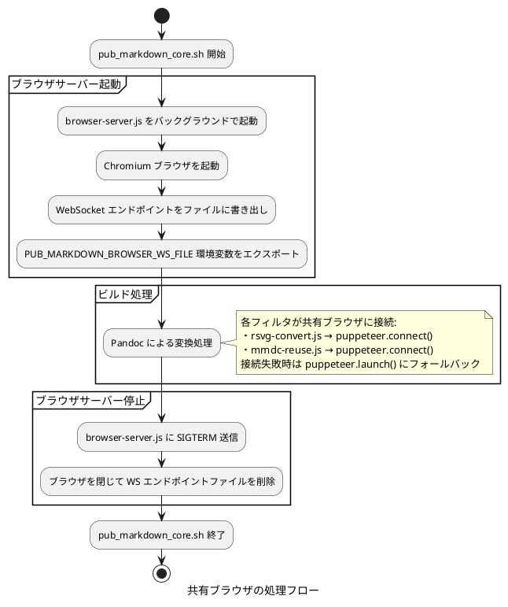
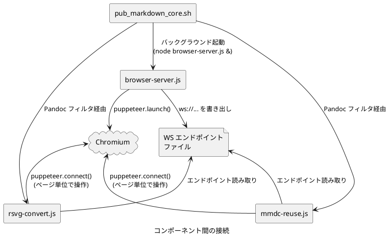

# 共有ブラウザインスタンスについて

## 概要

pub_markdown のビルドプロセスでは、SVG→PNG 変換 (rsvg-convert.js) や Mermaid 図のレンダリング (mmdc) において Puppeteer 経由で Chromium ブラウザを使用します。共有ブラウザインスタンス機構により、ビルド全体で 1 つのブラウザを使い回すことで起動コストを削減しています。

## 背景と課題

### ブラウザ起動コストの問題

Puppeteer による Chromium 起動には約 1〜2 秒を要します。ビルド対象に多数の SVG 画像や Mermaid 図が含まれる場合、以下の累積コストが発生します。

1. **rsvg-convert.js**: Pandoc が DOCX 生成時に SVG→PNG 変換のたびにブラウザを起動・停止
2. **mmdc (mermaid-cli)**: Mermaid 図のレンダリングのたびにブラウザを起動・停止

例えば SVG 画像 10 個と Mermaid 図 5 個を含むドキュメントの場合、ブラウザの起動だけで 15〜30 秒のオーバーヘッドが発生してしまいます。

## アーキテクチャ

### ファイル構成

```text
browser-server.js       # 共有ブラウザサーバー (新規)
mmdc-reuse.js           # 共有ブラウザ対応 Mermaid レンダラー (新規)
rsvg-convert.js         # SVG→PNG 変換 (共有ブラウザ対応に改修)
mmdc-wrapper.sh         # Mermaid CLI ラッパー (共有ブラウザ対応に改修)
pub_markdown_core.sh    # メインビルドスクリプト (ライフサイクル管理を追加)
```

### 処理フロー



### コンポーネント間の接続



## 技術仕様

### 環境変数

| 変数名 | 説明 |
|---|---|
| `PUB_MARKDOWN_BROWSER_WS_FILE` | WebSocket エンドポイントが書かれたファイルのパス |

### WebSocket エンドポイントファイル

- パス: `/tmp/pub_markdown_browser_ws_<PID>` (PID は pub_markdown_core.sh のプロセス ID)
- 内容: `ws://127.0.0.1:<PORT>/devtools/browser/<UUID>` 形式の WebSocket URL
- ライフサイクル: ビルド開始時に作成、ビルド終了時 (正常・異常とも) に削除

### browser-server.js

共有ブラウザの起動と管理を行うサーバースクリプトです。

```javascript
puppeteer.launch({ args: ['--no-sandbox'] })
```

- Puppeteer のデフォルトブラウザ検出を使用します
- `chrome-wrapper.sh` は適用しません (WebSocket 競合回避はファイルベースの待機で代替)
- SIGTERM/SIGINT でブラウザを閉じ、エンドポイントファイルを削除して終了します
- ブラウザプロセスが予期せず終了した場合もエンドポイントファイルを削除します

### rsvg-convert.js の共有ブラウザ対応

接続ロジック:

1. `PUB_MARKDOWN_BROWSER_WS_FILE` 環境変数を確認
2. ファイルが存在すれば WebSocket エンドポイントを読み取り、`puppeteer.connect()` で接続
3. 接続失敗時は `puppeteer.launch()` にフォールバック

リソース管理:

- **共有ブラウザ使用時**: `page.close()` でページのみ閉じ、`browser.disconnect()` で切断
- **専用ブラウザ使用時**: `browser.close()` でブラウザごと閉じる

### mmdc-reuse.js

`@mermaid-js/mermaid-cli` の `mmdc` コマンドの代替として動作する Mermaid レンダラーです。

対応オプション:

- `-i <input.mmd>`: 入力ファイル (Mermaid ダイアグラムコード)
- `-o <output.svg>`: 出力ファイル (SVG)
- `-b transparent`: 背景色 (デフォルト: white)

Mermaid ライブラリの検出:

以下の優先順位でブラウザバンドル (`mermaid.min.js`) を探索します。

1. `require.resolve('mermaid/package.json')` 経由
2. `require.resolve('@mermaid-js/mermaid-cli/package.json')` 経由のネスト検索
3. `node_modules/mermaid/dist/mermaid.min.js` (スクリプトディレクトリ起点)
4. `node_modules/@mermaid-js/mermaid-cli/node_modules/mermaid/dist/mermaid.min.js`

レンダリング処理:

1. 共有ブラウザに接続 (またはフォールバックで新規起動)
2. 新規ページを作成し、Mermaid ライブラリを `addScriptTag()` で読み込み
3. `mermaid.render()` でダイアグラムを SVG にレンダリング
4. SVG を出力ファイルに書き込み
5. ページを閉じて切断

### mmdc-wrapper.sh の分岐ロジック

```bash
if PUB_MARKDOWN_BROWSER_WS_FILE が存在する
    → mmdc-reuse.js を使用 (共有ブラウザ経由)
else
    → mmdc を使用 (chrome-wrapper.sh 経由)
```

### pub_markdown_core.sh のライフサイクル管理

起動シーケンス:

1. `PUB_MARKDOWN_BROWSER_WS_FILE` 環境変数を設定
2. `browser-server.js` をバックグラウンドで起動
3. エンドポイントファイルが作成されるまでポーリング待機 (最大 30 秒、100ms 間隔)
4. 待機タイムアウト時はフォールバックモードに切り替え

停止処理:

- 正常終了時: ビルド完了後に `kill` → `wait` → ファイル削除
- 異常終了時: `trap` ハンドラ (SIGINT/SIGTERM) で同じ停止処理を実行

## prepare_puppeteer_env.sh との関係

### 二重ラップの回避

`browser-server.js` の起動時に `prepare_puppeteer_env.sh` を適用すると、以下の無限ループが発生する可能性があります:

1. `pub_markdown_core.sh` が `prepare_puppeteer_env.sh` を source → `PUPPETEER_EXECUTABLE_PATH` = `chrome-wrapper.sh`
2. 後に `rsvg-convert` シェルスクリプトが `prepare_puppeteer_env.sh` を再度 source → `ORG_PUPPETEER_EXECUTABLE_PATH` = `chrome-wrapper.sh`
3. フォールバック時に `puppeteer.launch()` が `chrome-wrapper.sh` を起動
4. `chrome-wrapper.sh` が `ORG_PUPPETEER_EXECUTABLE_PATH` を復元 → `PUPPETEER_EXECUTABLE_PATH` = `chrome-wrapper.sh`
5. `puppeteer.executablePath()` が `chrome-wrapper.sh` を返す → **無限ループ**

この問題を避けるため、`browser-server.js` は `prepare_puppeteer_env.sh` を経由せず、Puppeteer のデフォルトブラウザ検出を使用します。

### プラットフォーム別の動作

| プラットフォーム | browser-server.js のブラウザ | フォールバック時のブラウザ |
|---|---|---|
| Linux | Puppeteer バンドルの Chromium | chrome-wrapper.sh 経由の Chromium |
| WSL | Puppeteer バンドルの Chromium | chrome-wrapper.sh 経由の Chromium |
| Windows (Git Bash) | Edge (`PUPPETEER_EXECUTABLE_PATH` 経由) | Edge (`PUPPETEER_EXECUTABLE_PATH` 経由) |

## フォールバック機構

共有ブラウザが利用できない場合は、都度ブラウザを起動します。

### フォールバック発生条件

1. `browser-server.js` の起動失敗 (Chromium が見つからない等)
2. WebSocket エンドポイントファイルの作成タイムアウト (30 秒)
3. 共有ブラウザへの接続失敗 (ブラウザクラッシュ等)

### フォールバック時の動作

- `PUB_MARKDOWN_BROWSER_WS_FILE` 環境変数が未設定になります
- `rsvg-convert.js` は `puppeteer.launch()` で自前のブラウザを起動します
- `mmdc-wrapper.sh` は `mmdc` コマンドを使用します

## 前提事項、制約事項

- `browser-server.js` は Puppeteer のデフォルトブラウザ検出に依存するため、`chrome-wrapper.sh` のバージョンフォールバック機能は利用されません
- `mmdc-reuse.js` は `@mermaid-js/mermaid-cli` に同梱される mermaid ライブラリのブラウザバンドルに依存します
- 同時に複数の pub_markdown ビルドを実行する場合でも、PID ベースのエンドポイントファイルにより干渉は発生しません
