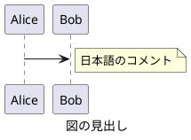
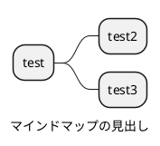
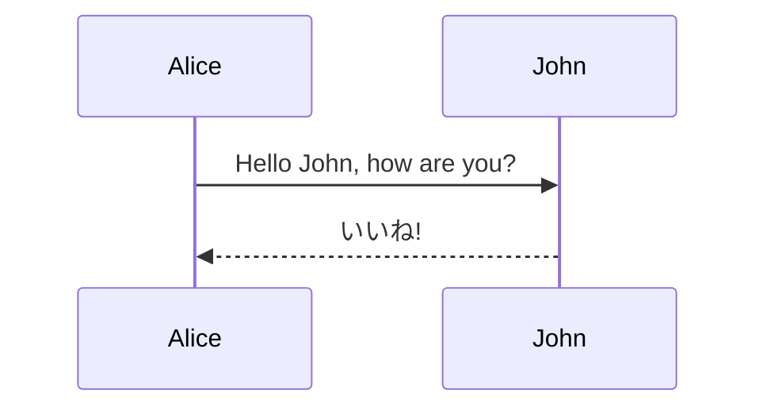

---
author:
    - Tetsuo Honda
subject: "subject"
description: "description"
date: "Thu, 28 Nov 2024 15:04:32 +0900"
abstract-title: "Abstract"
abstract: "概要"
---

<!--ja:-->
# トップレベルの index
<!--:ja-->
<!--en:
# index of top level
:en-->

## 概要

本ドキュメントは、Markdown と Pandoc によるドキュメント発行のサンプル、運用方法およびノウハウをまとめたものである。

## 言語切替

日本語と英語を同一の Markdown に記載できる。

発行する際に、それぞれの言語別タグを切り替えて処理を行うことから、成果物は単一言語向けとすることができる。

### 記載方法

#### ニュートラル言語

特殊タグで囲わない限り、 Markdown はニュートラル言語として扱われ、日英双方の成果物に含まれる。

#### 日本語・英語

以下のタグで囲うことにより、それぞれの言語別の成果物にのみ表示される。

```markdown
<!--ja:
日本語 (編集プレビューで非表示状態)
:ja-->

<!--ja:-->
日本語 (編集プレビューで表示状態)
<!--:ja-->

<!--en:
English Hidden in Markdown
:en-->

<!--en:-->
English Visible in Markdown
<!--:en-->
```

#### 編集時の表示

編集時の表示・非表示は、発行後の表示状態に影響しない。

<!--ja:-->
### 記載例
<!--:ja-->
<!--en:
### Sample
:en-->

<!--ja:
日本語 (編集プレビューで非表示状態)
:ja-->

<!--ja:-->
日本語 (編集プレビューで表示状態)
<!--:ja-->

<!--en:
English Hidden in Markdown
:en-->

<!--en:-->
English Visible in Markdown
<!--:en-->

### Visual Studio Code 拡張機能

以下の Visual Studio Code 拡張機能により、編集時の言語切替作業の効率化が可能。

+ [vscode-multilang-md](https://marketplace.visualstudio.com/items?itemName=TetsuoHonda.vscode-multilang-md)

## 詳細情報

文章に詳細情報を記載する場合は以下のタグを利用する。

### 記載方法

```markdown
<!--details:
詳細 (編集プレビューで非表示状態)
:details-->

<!--details:-->
詳細 (編集プレビューで表示状態)
<!--:details-->
```

#### 編集時の表示

編集時の表示・非表示は、発行後の表示状態に影響しない。

### 記載例

<!--details:
詳細 (編集プレビューで非表示状態)
:details-->

<!--details:-->
詳細 (編集プレビューで表示状態)
<!--:details-->

### Visual Studio Code 拡張機能

以下の Visual Studio Code 拡張機能により、編集時の詳細切替作業の効率化が可能。

+ [vscode-multilang-md](https://marketplace.visualstudio.com/items?itemName=TetsuoHonda.vscode-multilang-md)

## 画像の挿入

画像を図として挿入する場合、`[` `]` による図のタイトルを Markdown に記載する。

> Pandoc にて、タイトルが定義されていない画像は図として扱われず、書式が設定されないため。

## PlantUML

PlantUML は各プラグインとの親和性を考慮し、以下の通り Markdown に記載する。

### 言語名

plantuml とする。

> puml は使用しない。

### Plantuml タグ

`@startuml` `@enduml` は必ず記載する。

> PlantUML プラグインにて、ドキュメント内の PlantUML を出力する際の識別に使いるため。

### タイトル

`@startuml` に続いてファイル名を記載する。

> Visual Studio Code の PlantUML プラグインにて、エクスポートする際のファイル名に使いられる。

また、上記とは別に `caption` キーワードにてタイトルを記載する。

> PlantUML の図の見出しとして使いられる。
> Pandoc での発行時には図のキャプションとなる。

背景色は、pandoc 側で透明にしている。

> skinparam backgroundColor transparent を自動付与している。
> すでに skinparam backgroundColor が定義されている場合は、置換する。

### 記載例





### Chrome 拡張機能

以下の Chrome 拡張機能により、GitBucket での PlantUML 図形のレンダリングが可能。

企業内のイントラネット環境等で利用する場合、PlantUML サーバの指定を必ず行うこと。

+ [Pegmatite-gitbucket](https://chromewebstore.google.com/detail/pegmatite-gitbucket/gkdjfofhecooaojkhbohidojebbpcene)

## Mermaid

Mermaid 記法について、以下の通り Markdown に記載する。  
Mermaid と PlantUML は実現できることが重複する。PlantUML を優先して採用すること。

### タイトル

コードブロックのファイル名として記載する。

### 記載例



## draw.io

draw.io は各プラグインとの親和性を考慮し、以下の通り Markdown に記載する。

### 形式

Markdown から引用して用いるため、drawio.svg とする。

Markdown から引用して表示した場合には代表シートのみ表示されるため、1 つの drawio.svg ファイルには複数シートを定義しない。

### Markdown への引用

原則、drawio.svg ファイルは、Markdown から参照する。

単一ファイルとしての drawio.svg ファイルは、docx フォーマットや html-self-contained フォーマットの出力結果には含まれない。

### 記載例


### ノウハウ

#### draw.io でテキストを含む図形が正しく変換できない場合の対処

docx 変換後に `Text is not SVG - cannot display` と表示されるケースがある。これは draw.io が .svg の高度な機能 (foreignObject) を利用しているためである。

[Why text in exported SVG images may not display correctly](https://www.drawio.com/doc/faq/svg-export-text-problems)

この問題を回避するため、テキスト記入時は以下とする。

+ 「テキスト」の 「ワードラップ」 のチェックを外す。
+ 「テキスト」の 「フォーマットされたテキスト」 のチェックを外す。

[Draw.io Integration](https://marketplace.visualstudio.com/items?itemName=hediet.vscode-drawio) プラグインを使用している場合は、`hediet.vscode-drawio.simpleLabels` の設定を行うことでデフォルトの動作を変更する。

> この設定を行っても、.svg へのエクスポート時の挙動が変わるのみで .drawio.svg ファイルの挙動は変わらないため、上記テキストの属性設定を行う必要がある。

#### ダーク テーマの Visual Studio Code で画面が見づらい場合

Draw.io Integration のテーマを loght テーマ (例: kennedy - light) に変更する。

+ [VSCodeでDraw.ioを編集できるようにするまで](https://zenn.dev/satonopan/articles/4177ed8b88e067)
+ [VScodeの拡張機能「Draw.io Integration」で背景色を白色に変更する方法](https://penpen-dev.com/blog/vscode-drawio/)

Visual Studio Code ステータスエリア (右下) の `Theme:` 部分をクリックすることで、拡張機能の設定を経由せずにテーマの変更ができる。

## OpenAPI

OpenAPI ファイルは、widdershins により Markdown に変換後、Pandoc に渡される。

### 記載例

[OpenAPI ファイルへ](books-swagger.yaml)

## AsyncAPI

現段階で、AsyncAPI の発行は未サポート。

AsyncAPI 1.0 形式については、widdershins により変換できる可能性があるが未検証。

## リンク

Markdown 内のリンクは、.html や .docx への変換時も維持される。

[サブフォルダの index へ](subfolder/index.md)

## コードスニペット

### Bash

```bash
echo "Hello"
```

### CSharp

```csharp
Debug.WriteLine("Test");
Debug.WriteLine("日本");
```

## 表

[列幅の指定方法](https://github.com/jgm/pandoc/issues/2486) により、ページ幅に収まらなかった場合の列幅を指定できる。

表に続いて、`Table:` を記載して表のキャプションを指定する。

|No.|内容     |
|--:|---------|
|  1|てすと   |
|  2|テスト   |
|  3|Test     |

Table: 表のキャプション

セル内に改行を挿入する場合は、`<br />` を使用する。

|No.|ヘッダ1行目<br />ヘッダ2行目|
|--:|---------|
|  1|内容1<br />内容2|
|  2|テスト   |
|  3|Test     |

Table: セル内での改行を含む表

以下の形式 (Markdown pipe tables) は Pandoc ではサポートされるが、[Markdown Preview Enhanced](https://marketplace.visualstudio.com/items?itemName=shd101wyy.markdown-preview-enhanced) プラグインでのプレビューは現時点で非サポートとなっている。
[Table: support grid tables](https://github.com/shd101wyy/vscode-markdown-preview-enhanced/issues/1571)

+------------------+-------------+
| Distance         | Time        |
| (km)             | (s)         |
+==================+=============+
| 12               | 34          |
+------------------+-------------+
| 56               | 78          |
+------------------+-------------+

Table: Markdown pipe tables による表 1

+-----+-----------+
|     | L2 and L3 |
| L1  +-----+-----+
|     | L2  | L3  |
+=====+=====+=====+
|     | BBB | CCC |
| AAA +-----+-----+
|     |   DDDDD   |
+-----+-----+-----+
|           | FFF |
|   EEEEE   +-----+
|           | GGG |
+-----------+-----+

Table: Markdown pipe tables による表 2

## メタデータ

Markdown の先頭に以下のように記載する。

```text
---
author:
    - author               <- 「作成者」プロパティ
    - author2              <- 複数人定義可能
subject: "subject"         <- 「件名」プロパティ
description: "description" <- 「コメント」プロパティ
abstract-title: "Abstract" <- 「概要タイトル」プロパティ
abstract: "概要"           <- 「概要」プロパティ
---
```

## 改ページ

docx 変換時に改ページを挿入したい場合は、`\newpage` を挿入する。

これは 1 つ目のパラグラフです。

\newpage

これは 2 つ目のパラグラフです。

### メタデータの扱い

+ 第 1 レベルのタイトルが、文書のタイトルになる (title の指定は無視される)。
+ date が指定されていない場合、発行時の日時が文章の日時になる。
  公開する場合に不要な差分発生を防ぐため、pub_markdown.config に autoSetDate: false を指定することで本処理は抑止可能。

## Pandoc テンプレート

bin/styles 以下にカスタマイズされた Pandoc テンプレートがある。

### html

`pandoc -D 'html'` コマンドで出力されたデフォルトテンプレートに置き換えることで、デフォルトの出力に変更できる。

### docx

`pandoc -o custom-reference.docx --print-default-data-file reference.docx` コマンドで出力したサンプルを Word テンプレート形式 (.dotx) で出力したものに置き換えることで、デフォルトの出力に変更できる。

図の幅はページサイズおよび余白に基づいて Pandoc で調整される。とじしろ (w:gutter) は考慮されないため、とじしろを定義した場合は図の横幅が期待通りとならない。テンプレート作成時は留意すること。

## 発行方法

+ Visual Studio Code で、タスク "exec pandoc" (Ctrl + Shift + B) を実行する。
+ 現在開いている Markdown のみを対象に発行を行う場合は、タスク "exec pandoc (current file)" を実行する。

成果物は、/docs 配下に、言語別、フォーマット別に生成される。

## 参考にしたサイト

+ [MarkdownをpandocでHTML化するときのノウハウ](https://kiririmode.hatenablog.jp/entry/20220227/1645935125)
+ [44種類のフォーマットに対応したPandocでMarkdownをHTML形式に変換する](https://dev.classmethod.jp/articles/pandoc-markdown2html/)
