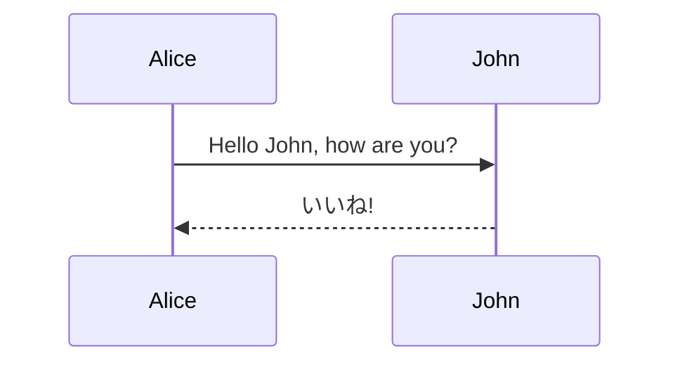

# Mermaid キャプションのサンプル

## 推奨

```{.mermaid caption="Mermaid のキャプション"}
sequenceDiagram
    Alice->>John: Hello John, how are you?
    John-->>Alice: いいね!
```

## 非推奨

Pandoc としては扱えるが、Markdown Preview Enhanced でのプレビューが正しく行われない。  
(Markdown Preview Enhanced 0.8.18 にて現象を確認)



## キャプションなし


