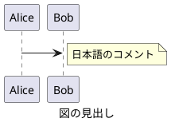

# 日本語を含むサブフォルダ



```plantuml
@startuml テスト
    caption 図の見出し
    Alice -> Bob
    note right
        日本語のコメント
    end note
@enduml
```

```{.mermaid caption="Mermaid のキャプション"}
sequenceDiagram
    Alice->>John: Hello John, how are you?
    John-->>Alice: いいね!
```
