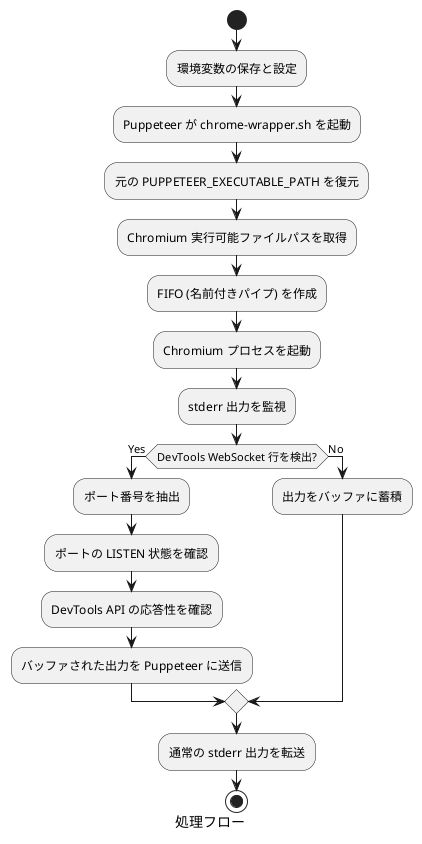

# chrome-wrapper について

## 概要

このスクリプト群は、Linux 環境下で Puppeteer を使用する際に発生する WebSocket 接続の競合状態 (race condition) を解決するための非破壊的な待機機構である。Puppeteer の Chromium 起動プロセスを透過的にラップし、DevTools WebSocket が完全に利用可能になるまで適切に待機することで、接続エラーを防止する。

## 背景と課題

### Puppeteer の WebSocket 接続問題

Puppeteer は内部的に Chrome DevTools Protocol を使用して Chromium ブラウザを制御するが、この通信は WebSocket 接続を通じて行われる。特に WSL 環境や仮想環境では、以下の問題が発生する可能性がある:

1. **タイミング競合**: Chromium が DevTools WebSocket ポートを開放したことを stderr に出力しても、実際にはまだポートが完全に利用可能でない場合がある
2. **接続拒否エラー**: `connect ECONNREFUSED 127.0.0.1:{PORT}` エラーが発生し、`puppeteer.launch()` が失敗する
3. **非決定的な動作**: 環境やシステム負荷により、成功したり失敗したりする不安定な挙動

### 従来の対処法の問題点

一般的な対処法として以下が提案されることがあるが、それぞれに課題がある:

- **固定的な sleep**: 環境により必要な待機時間が異なり、過剰な遅延を生む
- **Puppeteer オプション調整**: 根本的な解決にならない場合が多い
- **リトライ機構**: アプリケーションレイヤーでの複雑な実装が必要

## アーキテクチャ

### ファイル構成

```text
chrome-wrapper.sh           # ラッパースクリプト
mmdc-wrapper.sh             # ラッパースクリプト
prepare_puppeteer_env.sh    # 環境設定用スクリプト
```

### 処理フロー



## 技術仕様

### 環境変数の管理

スクリプトは以下の環境変数を使用して非破壊的な動作を実現する:

- `PUPPETEER_EXECUTABLE_PATH`: Puppeteer が使用する実行可能ファイルパス
- `ORG_PUPPETEER_EXECUTABLE_PATH`: 元の実行可能ファイルパスの退避用

### ポート待機アルゴリズム

DevTools WebSocket ポートが完全に利用可能になるまでの確認は、以下の 2 段階で行われる:

1. **LISTEN 状態確認**:
   ```bash
   ss -tln | awk '{print $1, $4}' | grep -E '^LISTEN\s+127\.0\.0\.1:'"$PORT"'$'
   ```

2. **API 応答確認**:
   ```bash
   curl -s --max-time 0.2 "http://127.0.0.1:$PORT/json/version"
   ```

### 出力バッファリング機構

stderr の出力は以下のロジックでバッファリングされる:

- DevTools WebSocket 行が出現するまで、すべての stderr 出力をメモリ上にバッファリング
- ポートが利用可能になった時点で、バッファされた出力を一括して Puppeteer に転送
- その後の出力は通常通りリアルタイムで転送

### FIFO による非同期処理

名前付きパイプ (FIFO) を使用して、Chromium プロセスの stderr 出力を非同期で処理する:

```bash
FIFO=$(mktemp -u)
mkfifo "$FIFO"
trap 'rm -f "$FIFO"' EXIT
```

## 使用方法

### 基本的なセットアップ

```bash
# スクリプトに実行権限を付与
chmod +x chrome-wrapper.sh
chmod +x prepare_puppeteer_env.sh

# 環境変数を設定
source prepare_puppeteer_env.sh

# Puppeteer アプリケーションを実行
node your-puppeteer-script.js
```

### カスタム Chromium パスの指定

特定の Chromium バイナリを使用したい場合:

```bash
export ORG_PUPPETEER_EXECUTABLE_PATH="/path/to/custom/chrome"
source prepare_puppeteer_env.sh
node your-script.js
```

### 既存プロジェクトへの統合

既存の Puppeteer プロジェクトに影響を与えることなく導入できる:

```bash
# プロジェクトディレクトリにスクリプトを配置
cp chrome-wrapper.sh prepare_puppeteer_env.sh /your/project/

# 起動スクリプトで環境を設定
source prepare_puppeteer_env.sh
npm start
```

## エラーハンドリング

### 主要なエラーケース

- **Chromium 実行ファイル未発見**: 適切なエラーメッセージで終了
- **FIFO 作成失敗**: システムの tmpfs 問題として診断可能
- **ポート待機タイムアウト**: 最大待機時間後に通常動作へフォールバック

### デバッグ支援

スクリプトは以下のデバッグ情報を stderr に出力する:

```bash
echo "Chrome wrapper script started." >&2
```

### クリーンアップ処理

プロセス終了時に FIFO ファイルを確実に削除:

```bash
trap 'rm -f "$FIFO"' EXIT
```

## トラブルシューティング

### よくある問題と解決方法

**問題**: `ss: command not found`

```bash
# Ubuntu/Debian
sudo apt-get install iproute2

# CentOS/RHEL
sudo yum install iproute
```

**問題**: `curl: command not found`

```bash
# Ubuntu/Debian
sudo apt-get install curl

# CentOS/RHEL
sudo yum install curl
```

**問題**: 権限エラー

```bash
chmod +x chrome-wrapper.sh prepare_puppeteer_env.sh
```

### ログ出力の確認

デバッグ時は以下の方法で詳細な動作を確認できる:

```bash
# stderr の出力を確認
node your-script.js 2> debug.log

# プロセス監視
ps aux | grep chrome-wrapper
```
