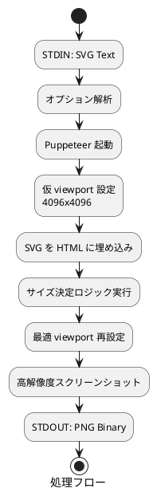

# rsvg-convert の独自実装について

## 概要

pub_markdown では、rsvg-convert を独自実装している。  
このスクリプトは、Pandoc で SVG ファイルを含む DOCX ファイルを生成する際に、標準の `rsvg-convert` の代替として動作する Puppeteer ベースの SVG→PNG 変換ツールである。

## 背景と目的

### Pandoc の画像変換の仕組み

Pandoc が Markdown やその他の形式から DOCX ファイルを生成する際、SVG 画像は直接 DOCX に埋め込むことができない。そのため、以下の流れで処理される。

1. **SVG 検出**: ドキュメント内の SVG 画像を識別する
2. **PNG 変換**: SVG を PNG 形式に変換 (`rsvg-convert` を使用)
3. **DOCX 埋め込み**: 変換した PNG を DOCX ファイルに埋め込む

### 標準 rsvg-convert の課題

従来の `rsvg-convert` には以下の制約がある。

- **フォント互換性**: システムにインストールされていないフォントの処理が困難
- **Web フォント対応**: オンラインフォントや CSS @import の処理が限定的
- **レンダリング品質**: 一部の複雑な SVG 要素で期待通りの出力が得られない場合

### 本スクリプトの利点

Puppeteer を使用することで以下の改善を実現している。

1. **高いフォント互換性**: Chromium エンジンによる豊富なフォント対応
2. **高解像度出力**: DPI 設定に基づく高精細 PNG 生成
3. **完全な SVG 仕様対応**: モダンブラウザと同等のレンダリング品質

## アーキテクチャ

### ファイル構成

```text
rsvg-convert.exe    # Windows 用エントリーポイント
rsvg-convert.cmd    # Windows 用バッチファイル (rsvg-convert.exe から起動)
rsvg-convert        # Linux 用シェルファイル (エントリーポイント)
rsvg-convert.js     # メインの Node.js スクリプト
```

### 処理フロー



## 技術仕様

### サポートされるオプション

スクリプトは標準 `rsvg-convert` と互換性のある以下のオプションをサポートする。

- `-f png`: 出力形式 (PNG 固定)
- `--dpi-x N`: 水平解像度 (デフォルト: 96)
- `--dpi-y N`: 垂直解像度 (デフォルト: 96)

### 高解像度レンダリング

```javascript
const scale = Math.max(dpiX, dpiY) * 3 / 96;
```

指定された DPI の 3 倍でレンダリングを行い、高精細な出力を実現している。

### SVG サイズ決定アルゴリズム

優先順位に従って SVG の実際のサイズを決定する。

1. **width/height 属性**: `width="100px" height="50px"` など単位付き値
2. **viewBox 属性**: `viewBox="0 0 100 50"` の幅・高さ
3. **実レンダリングサイズ**: ブラウザでの実際の描画サイズ

### 単位変換対応

SVG で使用される各種単位を正確にピクセルに変換する。

- **px**: そのまま (基準単位)
- **pt**: 1pt = 1.25px
- **pc**: 1pc = 15px  
- **mm**: 1mm ≈ 3.78px
- **cm**: 1cm = 37.8px
- **in**: 1in = 96px

## 使用方法

### Pandoc での利用

通常の Pandoc 使用時に、システムの `rsvg-convert` の代わりに本スクリプトが自動的に呼び出される。

```bash
pandoc input.md -o output.docx
```

### 直接実行

コマンドラインから直接 SVG 変換も可能である。

```bash
# 標準解像度
echo "<svg width='100' height='100'>...</svg>" | node rsvg-convert.js

# 高解像度指定
echo "<svg>...</svg>" | node rsvg-convert.js --dpi-x 300 --dpi-y 300
```

### 最適化ポイント

- `--no-sandbox` フラグでセキュリティオーバーヘッドを削減
- `waitUntil:'load'` で外部リソースの完全読み込みを保証
- `omitBackground:true` で透明背景を維持

## エラーハンドリング

主要なエラーケースと対応を以下に示す。

- **空の STDIN**: 終了コード 2 で異常終了
- **非 PNG 形式指定**: 終了コード 1 で異常終了  
- **Puppeteer エラー**: 終了コード 3 で詳細エラー出力

## 前提事項、制約事項

- PNG 出力のみサポート (SVG、PDF 等は未対応)
- Node.js + Puppeteer 環境が必要
