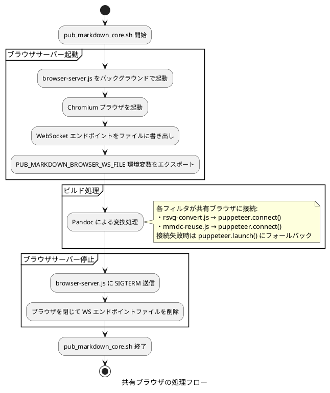
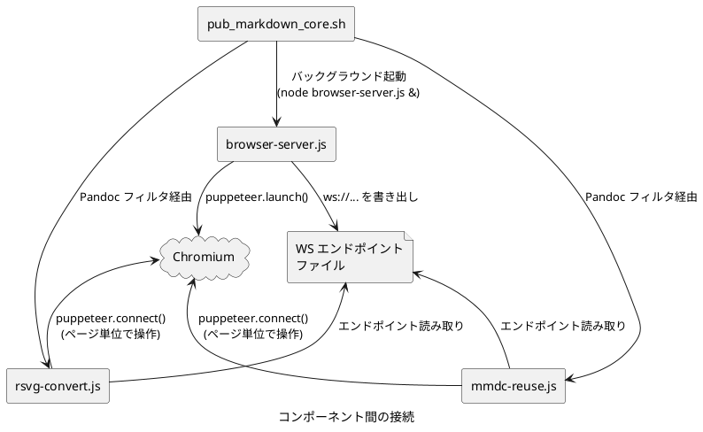

# 共有ブラウザー インスタンスについて

## 概要

pub_markdown のビルド プロセスでは、SVG→PNG 変換 (rsvg-convert.js) や Mermaid 図のレンダリング (mmdc) において Puppeteer 経由で Chromium ブラウザーを使用します。共有ブラウザー インスタンス機構により、ビルド全体で 1 つのブラウザーを使い回すことで起動コストを削減しています。

## 背景と課題

### ブラウザー起動コストの問題

Puppeteer による Chromium 起動には約 1〜2 秒を要します。ビルド対象に多数の SVG 画像や Mermaid 図が含まれる場合、以下の累積コストが発生します。

1. **rsvg-convert.js**: Pandoc が DOCX 生成時に SVG→PNG 変換のたびにブラウザーを起動・停止
2. **mmdc (mermaid-cli)**: Mermaid 図のレンダリングのたびにブラウザーを起動・停止

例えば SVG 画像 10 個と Mermaid 図 5 個を含むドキュメントの場合、ブラウザーの起動だけで 15〜30 秒のオーバーヘッドが発生してしまいます。

## アーキテクチャー

### ファイル構成

```text
browser-server.js       # 共有ブラウザサーバー (新規)
mmdc-reuse.js           # 共有ブラウザ対応 Mermaid レンダラー (新規)
rsvg-convert.js         # SVG→PNG 変換 (共有ブラウザ対応に改修)
mmdc-wrapper.sh         # Mermaid CLI ラッパー (共有ブラウザ対応に改修)
pub_markdown_core.sh    # メインビルドスクリプト (ライフサイクル管理を追加)
```

### 処理フロー



### コンポーネント間の接続



## 技術仕様

### 環境変数

| 変数名 | 説明 |
|---|---|
| `PUB_MARKDOWN_BROWSER_WS_FILE` | WebSocket エンドポイントが書かれたファイルのパス |

### WebSocket エンドポイント ファイル

- パス: `/tmp/pub_markdown_browser_ws_<PID>` (PID は pub_markdown_core.sh のプロセス ID)
- 内容: `ws://127.0.0.1:<PORT>/devtools/browser/<UUID>` 形式の WebSocket URL
- ライフサイクル: ビルド開始時に作成、ビルド終了時 (正常・異常とも) に削除

### browser-server.js

共有ブラウザーの起動と管理を行うサーバー スクリプトです。

```javascript
puppeteer.launch({ args: ['--no-sandbox'] })
```

- Puppeteer のデフォルト ブラウザー検出を使用します
- `chrome-wrapper.sh` は適用しません (WebSocket 競合回避はファイル ベースの待機で代替)
- SIGTERM/SIGINT でブラウザーを閉じ、エンドポイント ファイルを削除して終了します
- ブラウザー プロセスが予期せず終了した場合もエンドポイント ファイルを削除します

### rsvg-convert.js の共有ブラウザー対応

接続ロジック:

1. `PUB_MARKDOWN_BROWSER_WS_FILE` 環境変数を確認
2. ファイルが存在すれば WebSocket エンドポイントを読み取り、`puppeteer.connect()` で接続
3. 接続失敗時は `puppeteer.launch()` にフォールバック

リソース管理:

- **共有ブラウザー使用時**: `page.close()` でページのみ閉じ、`browser.disconnect()` で切断
- **専用ブラウザー使用時**: `browser.close()` でブラウザーごと閉じる

### mmdc-reuse.js

`@mermaid-js/mermaid-cli` の `mmdc` コマンドの代替として動作する Mermaid レンダラーです。

対応オプション:

- `-i <input.mmd>`: 入力ファイル (Mermaid ダイアグラム コード)
- `-o <output.svg>`: 出力ファイル (SVG)
- `-b transparent`: 背景色 (デフォルト: white)

Mermaid ライブラリの検出:

以下の優先順位でブラウザー バンドル (`mermaid.min.js`) を探索します。

1. `require.resolve('mermaid/package.json')` 経由
2. `require.resolve('@mermaid-js/mermaid-cli/package.json')` 経由のネスト検索
3. `node_modules/mermaid/dist/mermaid.min.js` (スクリプト ディレクトリ起点)
4. `node_modules/@mermaid-js/mermaid-cli/node_modules/mermaid/dist/mermaid.min.js`

レンダリング処理:

1. 共有ブラウザーに接続 (またはフォールバックで新規起動)
2. 新規ページを作成し、Mermaid ライブラリを `addScriptTag()` で読み込み
3. `mermaid.render()` でダイアグラムを SVG にレンダリング
4. SVG を出力ファイルに書き込み
5. ページを閉じて切断

### mmdc-wrapper.sh の分岐ロジック

```bash
if PUB_MARKDOWN_BROWSER_WS_FILE が存在する
    → mmdc-reuse.js を使用 (共有ブラウザ経由)
else
    → mmdc を使用 (chrome-wrapper.sh 経由)
```

### pub_markdown_core.sh のライフサイクル管理

起動シーケンス:

1. 対象ファイルを収集し、共有ブラウザーが必要か判定
2. 必要な場合のみ `PUB_MARKDOWN_BROWSER_WS_FILE` 環境変数を設定
3. `browser-server.js` をバックグラウンドで起動
4. エンドポイント ファイルが非空になるまでポーリング待機
5. 起動プロセスの終了または待機タイムアウト時はフォールバック モードに切り替え

起動判定:

- `PUB_MARKDOWN_BROWSER_REUSE=auto` (デフォルト): `docxOutput=true` かつ対象 Markdown に Mermaid または `.svg` 参照がある場合のみ起動
- `PUB_MARKDOWN_BROWSER_REUSE=always`: 対象ファイルの内容に関係なく起動
- `PUB_MARKDOWN_BROWSER_REUSE=off`: 共有ブラウザーを起動しない

起動待機:

- デフォルトは 30 秒
- `PUB_MARKDOWN_BROWSER_START_TIMEOUT_SEC` で秒数を上書き可能
- WebSocket エンドポイントを書き出す前に、DevTools API (`/json/version`) が `webSocketDebuggerUrl` を返すことを確認する
- `browser-server.js` が先に終了した場合は、タイムアウトを待たずにフォールバックする
- フォールバック時は `browser-server.js` の診断ログを警告として出力する

停止処理:

- 正常終了時: ビルド完了後に `kill` → `wait` → ファイル削除
- 異常終了時: `trap` ハンドラー (SIGINT/SIGTERM) で同じ停止処理を実行

## prepare_puppeteer_env.sh との関係

### 二重ラップの回避

`browser-server.js` の起動時に `prepare_puppeteer_env.sh` を適用すると、以下の無限ループが発生する可能性があります:

1. `pub_markdown_core.sh` が `prepare_puppeteer_env.sh` を source → `PUPPETEER_EXECUTABLE_PATH` = `chrome-wrapper.sh`
2. 後に `rsvg-convert` シェル スクリプトが `prepare_puppeteer_env.sh` を再度 source → `ORG_PUPPETEER_EXECUTABLE_PATH` = `chrome-wrapper.sh`
3. フォールバック時に `puppeteer.launch()` が `chrome-wrapper.sh` を起動
4. `chrome-wrapper.sh` が `ORG_PUPPETEER_EXECUTABLE_PATH` を復元 → `PUPPETEER_EXECUTABLE_PATH` = `chrome-wrapper.sh`
5. `puppeteer.executablePath()` が `chrome-wrapper.sh` を返す → **無限ループ**

この問題を避けるため、`browser-server.js` は `prepare_puppeteer_env.sh` を経由せず、Puppeteer のデフォルト ブラウザー検出を使用します。

### プラットフォーム別の動作

| プラットフォーム | browser-server.js のブラウザー | フォールバック時のブラウザー |
|---|---|---|
| Linux | Puppeteer バンドルの Chromium | chrome-wrapper.sh 経由の Chromium |
| WSL | Puppeteer バンドルの Chromium | chrome-wrapper.sh 経由の Chromium |
| Windows (Git Bash) | Edge (`PUPPETEER_EXECUTABLE_PATH` 経由) | Edge (`PUPPETEER_EXECUTABLE_PATH` 経由) |

## フォールバック機構

共有ブラウザーが利用できない場合は、都度ブラウザーを起動します。

### フォールバック発生条件

1. `browser-server.js` の起動失敗 (Chromium が見つからない等)
2. WebSocket エンドポイント ファイルの作成タイムアウト
3. 共有ブラウザーへの接続失敗 (ブラウザー クラッシュ等)

### フォールバック時の動作

- `PUB_MARKDOWN_BROWSER_WS_FILE` 環境変数が未設定になります
- `rsvg-convert.js` は `puppeteer.launch()` で自前のブラウザーを起動します
- `mmdc-wrapper.sh` は `mmdc` コマンドを使用します

## 前提事項、制約事項

- `browser-server.js` は Puppeteer のデフォルト ブラウザー検出に依存するため、`chrome-wrapper.sh` のバージョン フォールバック機能は利用されません
- `mmdc-reuse.js` は `@mermaid-js/mermaid-cli` に同梱される mermaid ライブラリのブラウザー バンドルに依存します
- 同時に複数の pub_markdown ビルドを実行する場合でも、PID ベースのエンドポイント ファイルにより干渉は発生しません
