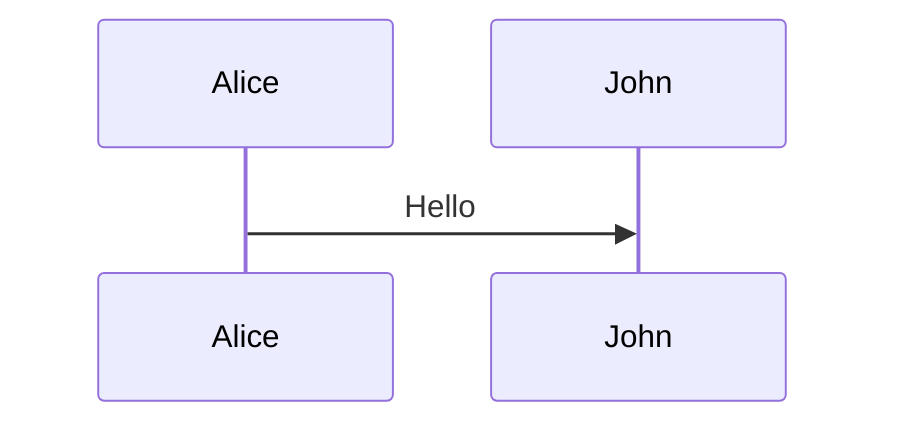

# コード ブロックのキャプション

コード ブロックのキャプションは、ブロックの直後に空行をはさんで `CodeBlock:` 行を記載して指定します。  
表の `Table:` と同じく、キャプションをフェンスの外に出す記法です。

````text


CodeBlock: 接続シーケンス {#fig:seq-open}
````

フェンスには言語名だけを記載するため、GitHub などの Web 表示でも図の描画とシンタックス ハイライトが機能します。

## 適用範囲

言語による区別は行わず、すべてのフェンス コード ブロックを同じ記法で扱います。

| コード ブロックの種類 | キャプションの扱い | ラベルの接頭辞 |
|---|---|---|
| Mermaid | 図のキャプション | `fig:` |
| PlantUML | 図のキャプション | `fig:` |
| ソース コード全般 (`c`、`makefile`、`text` など、言語指定なしを含む) | コード ブロックのキャプション | `lst:` |

## 記法

- 対象は直前のコード ブロックだけです。直前がコード ブロックでない `CodeBlock:` 段落は、通常の段落として出力されます。
- キャプションは `CodeBlock:` に続けて記載します。前後の空白は除去されます。
- 末尾の `{#lst:xxx}` または `{#fig:xxx}` は省略可能なラベルです。ラベルを付けた場合のみ、pandoc-crossref による採番と `[@lst:xxx]` 形式の相互参照の対象になります。
- キャプションを段落内で改行すると、キャプションも複数行で出力されます。docx 出力での改行には既知の課題があります (`mermaid.lua` の TODO を参照)。

## 処理の流れ

キャプションの正規化と描画を分離しています。

1. `codeblock-caption-line.lua` が `CodeBlock:` 段落を取り込み、直前のコード ブロックの `caption` 属性と identifier へ畳み込みます。言語は判定しません。
2. 描画は種類ごとに分かれます。
    - Mermaid は `mermaid.lua` が処理します。HTML 出力では図を画像化せず、`<pre class="mermaid">` を含む Figure として出力します。それ以外の出力形式では画像化した Figure を出力します。
    - PlantUML は `plantuml.lua` が処理します。`caption` 属性がない場合は、PlantUML ソース内の `caption` 行や `@startuml` のタイトルをキャプションとして採用します。
    - それ以外のコード ブロックは `codeblock-caption.lua` が処理し、`custom-style` が `Source Code Caption` の段落をコード ブロックの直後に出力します。
3. ラベル付きのコード ブロックは pandoc-crossref がリストとして採番します。pandoc-crossref はキャプションをコード ブロックの上に配置するため、`listing-caption-style.lua` が末尾へ移動し、`Source Code Caption` を付与します。

フィルターの適用順序は次の通りです。`codeblock-caption-line.lua` は `plantuml.lua` より前、`listing-caption-style.lua` は pandoc-crossref より後に置く必要があります。

```text
fix-line-break.lua
  -> codeblock-caption-line.lua
  -> plantuml.lua
  -> mermaid.lua
  -> (中略)
  -> codeblock-caption.lua
  -> pandoc-crossref
  -> listing-caption-style.lua
```

## pandoc-crossref がない場合

pandoc-crossref はオプションであり、導入していない環境でも発行できます。  
`pub_markdown_core.sh` は pandoc-crossref の有無をメタデータ `docsfw-crossref` で Lua フィルターへ通知します。

- pandoc-crossref がある場合、ラベル付きのコード ブロックは `codeblock-caption.lua` では処理せず、pandoc-crossref に委譲します。
- pandoc-crossref がない場合、ラベル付きのコード ブロックも `codeblock-caption.lua` が処理します。採番と相互参照は行われず、キャプションだけが出力されます。

## 採番の日本語ラベル

pandoc-crossref のラベルは `set-meta.lua` が日本語に設定します。文書のフロント マターで上書きできます。

| メタデータ | 既定値 | 用途 |
|---|---|---|
| `figureTitle` | 図 | 図のキャプションの接頭辞 |
| `tableTitle` | 表 | 表のキャプションの接頭辞 |
| `listingTitle` | リスト | リストのキャプションの接頭辞 |
| `figPrefix` | 図 | 本文中の図の参照の接頭辞 |
| `tblPrefix` | 表 | 本文中の表の参照の接頭辞 |
| `lstPrefix` | リスト | 本文中のリストの参照の接頭辞 |

## 廃止した記法

次の 2 つの記法は廃止しました。いずれも Pandoc 固有の拡張であり、GitHub などの Web 表示で言語の判定に失敗するためです。

| 廃止した記法 | 置き換え |
|---|---|
| ` ```{.mermaid caption="キャプション"} ` | ` ```mermaid ` と `CodeBlock: キャプション` |
| ` ```text:Sample.txt ` | ` ```text ` と `CodeBlock: Sample.txt` |

廃止した `caption` 属性が残っている場合は、標準エラー出力へ警告を出力したうえで属性を破棄します。キャプションは出力されません。  
`CodeBlock:` 行を併記している場合は、警告を出力したうえで `CodeBlock:` 行の値を採用します。

## サンプル

- [コード ブロック キャプションのサンプル](sample/codeblock-caption.md)
- [Mermaid キャプションのサンプル](sample/mermaid-caption.md)
- [相互参照サンプル](sample/crossref.md)
