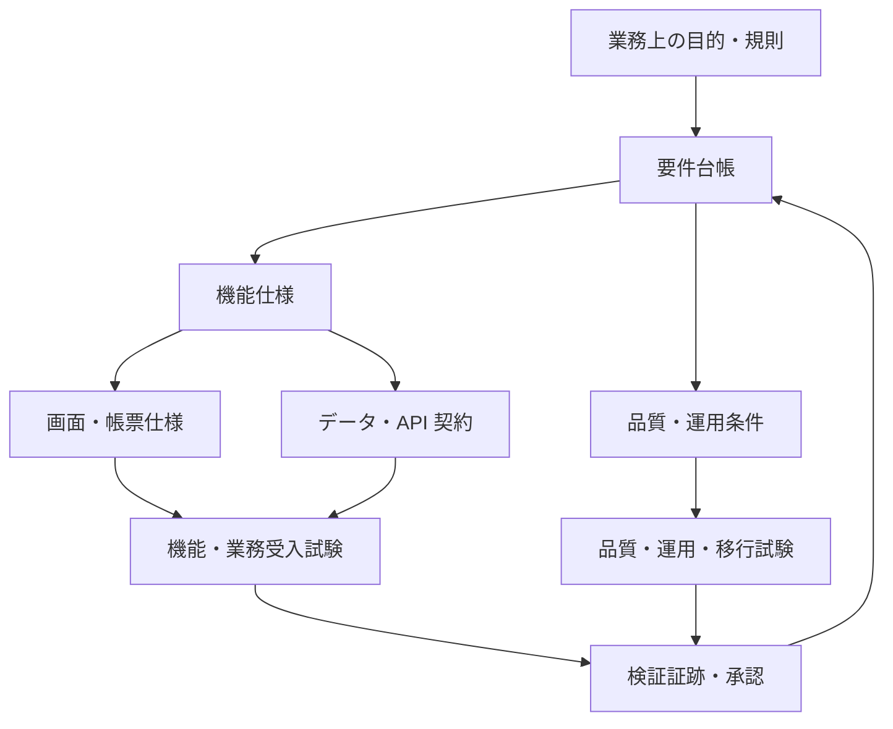
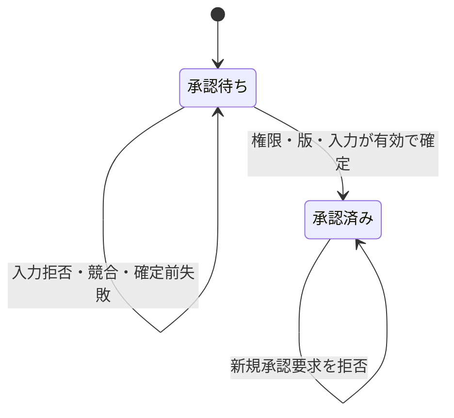

# 情報システムの要件定義書・機能仕様書に関する調査レポート

調査基準日: 2026-10-09 (日本時間)  
対象: 国内外の公開ガイドライン、公開テンプレート、調達仕様書、実プロジェクトの要求仕様書、OSS の機能提案書  
成果物: 記載項目の比較、項目カタログ、Markdown テンプレート、記入例、レビュー基準、出典一覧

## 内容への案内

| 読みたい内容 | 参照先 |
| --- | --- |
| 文書の目的と違い | [文書の役割と境界](#文書の役割と境界) |
| 公開事例と記載項目 | [公開資料と事例の比較](#公開資料と事例の比較)、[要件定義書の推奨記載項目](#要件定義書の推奨記載項目)、[機能仕様書の推奨記載項目](#機能仕様書の推奨記載項目) |
| コピーして使うひな形 | [再利用できる Markdown テンプレート](#再利用できる-markdown-テンプレート) |
| 記入とレビュー | [一つの記入例で要件から検証までをつなぐ](#一つの記入例で要件から検証までをつなぐ)、[レビューと完成判定](#レビューと完成判定) |
| 根拠と原資料 | [出典一覧と参照箇所](#出典一覧と参照箇所) |

## 調査から得られた結論

公開資料を比較すると、要件定義書は「実現する業務・サービス、対象範囲、必要な機能、品質水準、移行・運用条件を合意するための情報」を中心に構成されます。一方、開発と試験に用いる機能仕様書には、機能ごとの入力、条件、処理、出力、状態変化、例外時の動作を具体化する必要があります。この整理は本レポートの文書運用案であり、すべての組織に共通する文書名称の定義ではありません。[S01], [S02], [S04], [S11]

実際には「機能仕様書」という名称であっても、国内の調達資料では製品が満たすべき機能と対応可否を並べた一覧表になっている事例があります。また、海外の Software Requirements Specification (SRS) には、機能、非機能、インターフェイス、検証方法をまとめている例が見られます。名称だけで詳細さや責任範囲を判断せず、文書の用途と承認対象を先に定めることが適切です。[S07], [S08], [S09], [S10]

本レポートでは、共通の要件台帳を基点に「要件定義書」「機能仕様書」「調達用機能適合表」を関連付ける構成を提案します。要件 ID、根拠、担当者、受入条件を保持し、機能仕様と試験へ追跡できるようにします。これは複数資料からの統合提案であり、いずれかの公開テンプレートの全文転記ではありません。

必要な記載量は案件によって異なります。小規模な機能追加では簡潔な概要と機能単位の仕様が中心になります。大規模な業務更改では、業務、データ、移行、運用、引き継ぎ、検収を含めて分冊化します。SCADA/EMS など停止や誤動作の影響が大きいシステムでは、状態・モード、時間制約、データ品質、障害時動作を追加します。本レポートはこうした用途別の調整方法も扱います。

## 本レポートの読み方と調査方法

### 事実、解釈、提案を分ける

「確認した内容」は、出典の本文、目次、表、公開ページ、配布ファイルで確認した事実を指します。「評価」は、その記載がどの用途に役立つかに関する本レポートの解釈です。「推奨項目」「テンプレート」は、本レポートで作成した提案を指します。後半のテンプレートに含まれる項目が、引用元で一律に義務付けられているわけではありません。

### 調査の対象と採用基準

対象は業務システム、Web サービス、自治体共通機能、会計、求人マッチング、通信ソフトウェア、OSS の機能追加です。実案件の文書だけでなく、記載漏れを確認する標準・ガイドと、作成方法を示すテンプレートを組み合わせました。

資料は原則として発行主体の公式サイトまたは公式リポジトリを採用しました。解説サイトの転載や出典不明のテンプレートは、主要な根拠には用いていません。ISO 規格は公式の公開概要を確認した範囲で扱い、有料本文の章構成や規定事項を確認済みとはしていません。[S17], [S18]

| 資料の種類 | この調査で確認する内容 | 調査上の注意 |
| --- | --- | --- |
| 標準・公的ガイド | 要件活動の範囲、品質、合意、非機能の観点 | 一般企業にも同じ義務があるとは限らない |
| 公開テンプレート | 章構成、記入欄、補助表、用途 | 配布者の想定案件に合わせた調整が必要 |
| 実案件の仕様書 | 実際の要求の記述形式、ID、検証欄、対応可否欄 | 公開版が最終承認版とは限らない |
| OSS の機能提案書 | 動機、非目標、設計、テスト、段階導入、運用準備 | 顧客との契約仕様書とは役割が異なる |
| 技術仕様・検証基準 | API 契約、セキュリティ、アクセシビリティ | 要件定義書全体のテンプレートではない |

### 確認範囲と限界

公開資料には政府・自治体の調達文書が多く、非公開の企業内文書は調査対象に含まれていません。そのため、この調査から業界全体の採用率や「最も一般的なテンプレート」を断定することはできず、企業における普及率は特定できません。

羽咋市の資料は公表 PDF の内容を確認しましたが、PDF 内で制定日・改訂版を特定できていません。掲載内容には古い OS の指定が残っているため、構成の事例として扱います。Enabel の SRS は表紙で Draft と明記された公開文書です。資料が公開されていることと、その要求が実装・検収済みであることは分けて扱います。[S07], [S09]

デジタル庁の要件定義書テンプレートは、公式サイトで 2026-07-15 更新の配布 ZIP を取得し、その中の `５章/要件定義書標準テンプレート.docx` を確認しました。文書内の日付は 2026-06-12 です。配布更新日と文書内改訂日を区別しています。[S01]

## 文書の役割と境界

### 本レポートで使用する文書名

以下は調査結果を整理するための用語対応です。各組織の既存文書名を変更する必要はなく、既存文書にどの情報を割り当てるかを確認するために使います。

| 文書・成果物 | 主な問い | 本レポートでの位置付け | 主な読者・合意者 |
| --- | --- | --- | --- |
| ビジネス要求・企画書 | なぜ必要か、何を改善するか | 背景、課題、成果指標、投資判断 | 業務責任者、経営、企画 |
| 業務要件定義 | 誰が、どの業務を、どの条件で行うか | 将来業務、役割、規則、規模、手作業との境界 | 業務部門、利用者、システム部門 |
| 要件定義書 | 何を、どの水準で、どの範囲まで実現するか | 業務・機能・非機能・移行・運用の合意基準 | 発注者、開発者、運用者、試験担当 |
| 機能要件一覧 | どの機能が必要か | 機能の網羅、優先度、対応関係 | 業務担当、製品選定者、開発者 |
| 機能仕様書 | 条件ごとにどう動くか | 外から観測可能な動作、入力・出力、例外、状態 | 業務担当、設計者、実装者、試験担当 |
| 基本設計・外部設計 | 利用者や連携先に何を提供するか | 画面、帳票、データ、外部 I/F、システム構成 | 業務担当、設計者、運用者 |
| 詳細設計・内部設計 | 内部でどの構造・方法で実現するか | モジュール、クラス、内部データ、実装アルゴリズム | 実装者、技術レビュー担当 |
| SRS | ソフトウェアに何を要求するか | 案件によって要件定義書と機能仕様書の双方に相当 | 顧客、開発者、品質保証担当 |
| PRD | 製品・機能が誰にどんな価値を提供するか | 目的、利用者、機能、成功条件、前提 | Product Owner、開発・デザイン担当 |
| RFP・調達仕様書 | 何を提案・納入し、どう比較・契約するか | 要求に加え、調達範囲、成果物、作業条件、評価条件 | 調達担当、提案者、契約担当 |
| KEP・RFC 型提案書 | 変更をなぜ採用し、どう導入・運用するか | 提案、設計、代替案、テスト、リリース判断 | プロジェクトのレビュアー、保守担当 |

SRS がユーザー要求の分解結果を開発・試験に十分な詳細で記述し、複数巻に分けてもよいことは NASA のガイドで確認できます。PRD と KEP の説明は、それぞれ Atlassian と Kubernetes の公開資料に基づきます。ただし、日本語の文書名との対応付けは本レポートの解釈です。[S11], [S12], [S13]

### 要件定義書と機能仕様書で同じ情報をどう扱うか

| 観点 | 要件定義書で合意する内容 | 機能仕様書で具体化する内容 |
| --- | --- | --- |
| 機能 | 利用者に提供する能力、対象範囲、優先度 | 開始条件、操作、入力、処理、出力、完了条件 |
| 業務規則 | ルールの内容、適用対象、決定権者 | 条件の組合せ、優先順位、計算・判定方法 |
| 画面 | 必要な画面、利用者、主要情報、操作方針 | 項目、表示条件、編集可否、入力検証、画面遷移 |
| データ | 意味、所有者、管理単位、保存・削除要件 | 型、単位、範囲、未設定の扱い、更新条件 |
| 連携 | 相手、目的、データ、頻度、責任境界 | スキーマ、応答、タイムアウト、再送、重複排除 |
| 性能 | 測定対象、負荷条件、目標値、受入条件 | 機能ごとの制約、待機時動作、上限超過時動作 |
| 障害 | 継続すべき業務、許容停止、回復目標 | 検出、画面表示、再実行、補償処理、復旧後の状態 |
| セキュリティ | 保護対象、認証・認可方針、監査要件 | 操作ごとの権限、検査時点、拒否時動作、記録項目 |
| 検証 | 合格条件、環境、責任者、証跡 | 機能単位の入力条件と期待結果、試験との対応 |

文書ごとに同じ条件を重複して記述しないことが重要です。共通規則を一か所で管理し、他の文書からは ID と版を参照します。設計段階で要件を変更する場合は、要件側の変更承認も必要になります。

### 要求から試験までの関係

次の図は本レポートの運用案です。画面仕様や API 仕様も、機能仕様と同じ要件に関連付けます。業務受入と品質試験の結果を合意済み要件へ戻せることが重要です。



## 公開資料と事例の比較

### 主要な調査対象

「実案件」は公開された具体的な対象システムの文書を指します。実装完了や品質の認定を意味するものではありません。「参照範囲」は実際に確認した範囲です。

| 資料 | 種別・対象 | 確認した版・時期 | 参照範囲 | 主な用途 |
| --- | --- | --- | --- | --- |
| デジタル庁 要件定義書標準テンプレート [S01] | 公的テンプレート、政府情報システム | 文書内 2026-06-12、配布 2026-07-15 | 配布 DOCX の目次・本文・表構成 | 全体構成と調達前の合意 |
| IPA ユーザーのための要件定義ガイド [S02] | 公的ガイド、業務システム | 第 2 版、2019、公式ページに第 2 版 2 刷の更新案内 | 公式の概要・目次・ドキュメント分類 | 業務要求と要件管理 |
| IPA 超上流から攻める IT 化の事例集 [S03] | 匿名企業の成果物事例集 | アーカイブ掲載 | 公開一覧の成果物名と説明 | 分冊・補助表の構成 |
| IPA 機能要件の合意形成ガイド [S04] | 公的ガイド、機能の合意 | ver.1.0、2010、アーカイブ掲載 | 公式構成と画面編の公開資料 | 外部設計の合意領域 |
| IPA 非機能要求グレード [S05] | 非機能要求の分類・合意支援 | 2018、公式の研修資料は 2019 表記 | 公式紹介、講義資料、使用条件 | 品質・基盤条件の洗い出し |
| デジタル庁 共通機能標準仕様書 [S06] | 自治体の共通機能標準 | 第 2.8 版、2026-09-30 公開 | 本文 PDF と配布資料の一覧 | 共通機能と別紙の分割 |
| 羽咋市 情報共有システム機能仕様書 [S07] | 公開事例、工事関連の情報共有 | PDF 内で制定日・版は未特定 | 全 4 ページ | 調達・採用時の機能条件 |
| 長与町 公会計システム機能仕様書 [S08] | 実案件の調達用機能表 | 2026 年度の公募、掲載ページ更新 2026-09-16 | 全 2 ページと公募ページ | 製品適合性と代替提案の比較 |
| Enabel AI-Driven Job Matching Platform SRS [S09] | 実案件の公開 SRS | 2025-05-19、Version 1.0、Draft | 全体目次、要求分類、機能表、非機能、付録 | Web サービスの要求整理 |
| NASA HDTN SRS [S10] | 実通信ソフトウェアの公開 SRS | NASA/TM-20240011318、2024 | 目次、要求表、検証・追跡章、付録 | 通信・状態・検証を含む仕様 |
| NASA SRS guidance [S11] | ソフトウェア要求仕様のガイド | Handbook Ver D、閲覧時点の公開ページ | Minimum Recommended Content と関連説明 | 検証可能な仕様の記述 |
| Atlassian PRD guide [S12] | ベンダー自身の製品要求作成ガイド | 閲覧時点の公開ページ | PRD の構成と作成・更新方針 | 製品開発・小規模機能追加 |
| Kubernetes KEP template [S13] | OSS の公式提案テンプレート | 閲覧時点の master | 目次、リリース確認、運用準備の質問 | 継続的な機能追加と段階導入 |
| Kubernetes KEP-1451 [S14] | 実機能提案、複数スケジューリング プロファイル | 文書内履歴は 2020 年を含む | 概要、構成、検証、運用・履歴 | テンプレートの実使用例 |
| Volere template [S15] | 民間の要求仕様テンプレート | 公開抜粋に Edition 20 表記 | 公開抜粋のみ、有料全文は未取得 | 要求の体系と将来要求の管理 |
| TIS/Fintan 要件定義基礎研修テキスト [S16] | SI 事業者の公開研修ガイド | 掲載 2019-03-28 | 公式紹介の構成・役割分担 | 発注者・ベンダーの協働 |

### デジタル庁のテンプレートはライフサイクル全体を扱う

確認した内容: 本文の大区分は業務要件、機能要件、非機能要件です。業務には手順、規模、時間・場所、指標、システム化範囲が含まれます。機能は機能、画面、帳票、データ、外部インターフェイスに分けられます。非機能には品質・方式に加えてテスト、移行、引き継ぎ、教育、運用、保守があります。テンプレート冒頭では参考文書と位置付けられています。[S01]

評価: 大規模な業務更改や調達で、運用開始までの合意事項を洗い出す出発点に適しています。一方、すべての小項目をそのまま埋める運用では、小さな案件の負担が増加します。案件の規模に合わせて本文と別紙を整理し、適用しない項目には理由を付ける運用を提案します。

### IPA の資料は業務、データ、機能の整合を考える材料になる

確認した内容: 要件定義ガイドの公式目次は、ビジネス要求、システム化要求、要件定義マネジメント、主要ドキュメントの作成を扱っています。事例集の公開一覧では、業務、データ、画面・帳票、運用等の成果物が分けて掲載されています。[S02], [S03]

評価: 1 冊の要件定義書だけで完結させるより、業務フロー、データ定義、機能一覧などを相互参照する考え方が扱いやすい構成です。レビューでは「章があるか」だけでなく、「業務で扱う情報をデータ定義と機能が過不足なく説明しているか」を確認することを提案します。匿名企業の掲載事例から、企業別の採用頻度までは判断できません。

### IPA の機能合意ガイドは機能仕様の分割単位を示す

確認した内容: 概要編と、画面、システム振舞い、データ モデル、帳票、バッチ、外部インターフェイスの 6 領域で構成されています。目的は発注者と開発者の認識の乖離による手戻りを防ぐことにあります。[S04]

評価: 機能仕様書を画面の説明だけで構成すると、バッチや連携、画面に現れない状態変化が脱落します。したがって、本レポートの機能仕様テンプレートでは、画面・帳票の有無にかかわらず、機能の動作とデータ変化を中心に据えます。

### 非機能要求グレードは数値と条件を話し合うために使う

確認した内容: IPA の公式講義資料には、可用性、性能・拡張性、運用・保守性、移行性、セキュリティ、システム環境・エコロジーの区分が示されています。また、項目一覧の情報とモデル システムのレベル値を組み合わせる活用シートが説明されています。[S05]

評価: 分類やレベルは抜け漏れを確認する補助になります。合意文書では、選んだレベルに加えて、対象、具体値、負荷・障害条件、測定方法まで残すことを提案します。モデル システムの推奨値をそのまま契約値とする根拠にはなりません。

### 自治体共通機能は本文と詳細資料を分けて管理する

確認した内容: 第 2.8 版の公開資料群は、共通機能の本文、機能要件、項目定義書、API 仕様書、ファイル連携の詳細技術仕様書などに分かれています。本文では共通機能の範囲、各機能の位置付け、業務フロー、連携の考え方が扱われています。[S06]

評価: 複数システムや複数事業者が関係する案件では、全体の役割・責任を本文に、項目や API 契約を別資料に配置する構成が参考になります。本文の版が更新されてもすべての別紙が同じ版になるとは限らないため、参照する個々の文書 ID・版を構成管理する必要があります。

### 羽咋市の機能仕様書はサービスの採用条件を示す

確認した内容: 文書は目的、適用範囲、運用条件、機能を記載しています。機能は工事情報、利用者情報、書類作成・決裁・管理、電子納品等に区分されています。費用やサポート条件も含まれ、クライアント条件には Windows Vista 以上の記載があります。[S07]

評価: この事例は、名称が機能仕様書であっても、個別機能の詳細設計だけを意味しないことを示しています。要求機能の整理には参考になりますが、古い環境指定や定性的な応答条件を現在の案件へそのまま移すことは適切ではありません。現在の対象環境と検証条件を別途定める必要があります。

### 長与町の機能仕様書は対応方法を比較する表になっている

確認した内容: 表の列は No.、目的区分、機能仕様、変更仕様、対応可否、備考です。対応可否には標準、改修、代替、不可の区分があります。データ管理、財務書類作成、確認・検証、出力、権限、履歴、運用等の要求が並んでいます。[S08]

評価: パッケージや SaaS 選定で、機能の有無に加え、改修や代替による実現を比較する用途に適しています。ただし、対応可能という回答だけでは受入条件は定まりません。提案内容を具体的な動作、制約、費用、保守責任へ落とし込み、契約・仕様へ対応付けることを提案します。

### Enabel の SRS は要求分類と機能表を組み合わせる

確認した内容: 2025-05-19 付の Version 1.0 は Draft で、求人マッチング サービスを対象としています。導入、全体説明、機能、外部インターフェイス、非機能、その他・付録で構成されています。FR、NFR、IR、DR、SR の要求分類を定義し、機能要求では ID と要求文を並べています。文書内で SHALL、SHOULD、MAY を開発フェーズと結び付けて定義しています。[S09]

評価: 要求 ID と型による管理は再利用しやすい方式です。一方、要求の強さと対象リリースを一つのキーワードに兼ねさせると、文書を移植した際に解釈に乖離が生じます。本レポートでは「必須性」「優先度」「対象リリース」を別の属性として定義します。原資料の用語定義を、そのまま RFC の一般的な意味だと解釈しないことが重要です。

### NASA HDTN の SRS は要求ごとに検証を近接させる

確認した内容: 通信ソフトウェア HDTN の要求表には、要求 ID、タイトル、要求、根拠、検証方法、検証条件の欄があります。本文は状態・モード、プロトコル別要求、環境、API、GUI 等を扱い、TBD/TBR の一覧を付録に持っています。第 4 章は検証計画を別文書へ、追跡マトリクスを MagicDraw プロジェクトへ参照しています。[S10]

評価: 要求、根拠、合否判断を近接させる形式は、通信、制御、基盤ソフトウェアで特に参考になります。追跡情報を SRS にすべて転載する必要はなく、正本の所在と版を特定する方式も可能です。表が存在することと、全要求の検証が完了していることは同義ではありません。

### PRD と KEP は機能追加の動機と導入判断を扱う

確認した内容: Atlassian の PRD ガイドは、関係者・状況、目標、背景、前提、ユーザー ストーリー、デザイン、未決事項、対象外を扱っています。Kubernetes の KEP テンプレートには、目標・非目標、提案、リスク、設計、テスト、段階移行、互換性、運用準備、代替案があります。KEP-1451 は複数のスケジューリング プロファイルを扱う具体的な使用例です。[S12], [S13], [S14]

評価: 継続的な製品開発では、全体の要件書を毎回作り直すより、機能追加単位で目的・変更動作・導入条件をまとめる方式が適しています。本レポートでは、共通要件を参照しながら変更仕様をレビューする運用を提案します。KEP は契約用の要件定義書と同じものではなく、要求・設計・リリース判断をまたぐ文書です。

### 民間テンプレートと SI ガイドの確認範囲

確認した内容: Volere の公式ページは Edition 20 の公開抜粋を提供し、要求の構造、将来要求の待機領域、解決案を区別する考え方を示しています。全文は有料であり、この調査では取得していません。TIS/Fintan の研修資料紹介は、概論、計画、業務要件、システム要件を区分し、ユーザー企業が要件を決定し、ベンダーが支援する役割を説明しています。[S15], [S16]

評価: 要求の理由、保留要求、合意担当を明確にする点は有用です。テンプレートの入手自体が、要求の妥当性や意思決定の代わりにはなりません。本レポートのテンプレートは独自に構成しており、Volere の有料全文や配布成果物を再現していません。

### 事例の構成を同じ観点で比較する

表中の「確認」は対象資料に当該情報が記載されることを確認したという意味です。「別資料」は参照先・配布資料への分割を確認したもの、「未確認」は今回の確認範囲で確認できていないものを指します。「未確認」から、その情報が存在しないとは判断できません。

| 観点 | デジタル庁テンプレート [S01] | 長与町 [S08] | Enabel [S09] | HDTN [S10] | KEP テンプレート [S13] |
| --- | --- | --- | --- | --- | --- | --- |
| 業務の手順・規模 | 確認 | 未確認 | 全体説明・利用者を確認 | 状態・モードを確認 | ユーザー ストーリー欄を確認 |
| 機能の列挙 | 確認 | 確認 | 確認 | 確認 | 提案・設計欄を確認 |
| 画面・帳票 | 確認 | 出力要求を確認 | UI 要求を確認 | GUI 要求を確認 | 未確認 |
| データ・外部連携 | 確認 | 取込・出力要求を確認 | 確認 | 確認 | 設計・依存関係欄を確認 |
| 品質条件 | 確認 | 一部の条件を確認 | 確認 | 環境等の要求を確認 | 拡張性等の質問欄を確認 |
| 要求 ID | 機能等の ID 欄を確認 | No. 欄を確認 | 要求分類別 ID を確認 | 要求表の ID を確認 | KEP 自体の識別を確認 |
| 要求ごとの根拠 | 未確認 | 未確認 | 未確認 | 欄を確認 | 提案全体の動機欄を確認 |
| 要求ごとの検証方法 | 未確認 | 未確認 | 未確認 | 欄を確認 | テスト計画欄を確認 |
| 対応可否・代替案の回答 | 未確認 | 欄を確認 | 未確認 | 未確認 | 代替案の節を確認 |
| 移行・引き継ぎ・運用 | 確認 | 運用要求を確認 | 移行・運用等を確認 | 別計画への参照を確認 | 導入・切り戻し・監視欄を確認 |

この比較からは、どれか 1 つの文書をすべての用途に流用するより、合意、選定、開発、検証、運用の用途別に情報を配置する方が扱いやすいと考えられます。これは掲載例の比較に基づく設計上の提案であり、利用頻度を示す統計的結論ではありません。

## 要件定義書の推奨記載項目

### 項目の適用方法

次のカタログは本レポートの統合案です。「基本」は原則として確認する項目、「条件付き」は案件に存在する場合に詳細化する項目を意味します。法令や契約が別の構成を要求する場合は、その指定を優先します。

完成の基準は「文章が埋まったか」ではなく、「対象、合意者、条件、判断基準が特定できるか」です。該当しない項目は空欄にせず、適用外の理由と判断者を残します。

### 文書管理、目的、対象範囲

| 項目 | 適用 | 記載する内容 | レビューで確認すること |
| --- | --- | --- | --- |
| 文書識別・版・状態 | 基本 | 文書 ID、版、作成日、状態、対象システム、対象リリース | 承認版と編集中の版を識別できる |
| 作成・レビュー・承認 | 基本 | 作成者、業務責任者、技術責任者、運用責任者、承認記録 | 各判断の責任者が明確である |
| 変更履歴 | 基本 | 変更理由、変更要求 ID、影響箇所、承認者、適用版 | 仕様変更の経緯を追跡できる |
| 背景・現状の課題 | 基本 | 業務上の問題、現状の制約、困りごとの根拠 | 機能導入と解決する問題がつながる |
| 目的・成果指標 | 基本 | 期待する業務成果、指標、測定主体、測定時期 | システム完成後に効果を判断できる |
| 対象範囲・対象外 | 基本 | 業務、利用者、拠点、対象データ、連携先、対象外事項 | 責任境界と追加要求の扱いが明確である |
| 関係者・意思決定 | 基本 | ステーク ホルダー、役割、決定権、意見の調整方法 | 意見が衝突した際の決定者が特定できる |
| 用語・表記規則 | 基本 | 業務用語、略語、必須性、単位、時間帯、日付基準 | 同じ語が複数の意味で使われていない |
| 前提・制約・依存 | 基本 | 外部条件、既存資産、予算・期間の制約、他案件への依存 | 事実、仮定、設計上の選好が分かれている |

### 業務、機能、データ、連携

| 項目 | 適用 | 記載する内容 | レビューで確認すること |
| --- | --- | --- | --- |
| 現行業務と将来業務 | 基本 | 業務フロー、役割、入出力、手作業、変更点 | システム導入後に誰が何を行うかが明確である |
| 業務規則 | 基本 | 判定規則、権限、締め処理、例外、規則の決定権者 | 例外や複数規則の優先順位が定まる |
| 利用者と権限 | 基本 | 利用者分類、組織・拠点範囲、代理操作、管理者 | 操作権限と閲覧範囲の双方が明確である |
| 業務量・利用条件 | 基本 | 通常・ピーク件数、同時利用、繁忙時期、提供時間、増加見込み | 性能・容量条件の根拠になる |
| 機能一覧 | 基本 | 機能 ID、目的、利用者、概要、関連業務、関連要件 | 対象業務を機能が過不足なく支える |
| ユース ケース | 基本 | 開始条件、関係者、主要な流れ、完了条件、例外 | 利用者の目的達成が確認できる |
| 必須性・優先度・リリース | 基本 | 実装義務、業務上の優先度、対象段階、依存機能 | 各属性が混同されていない |
| 画面要求 | 条件付き | 画面一覧、利用者、情報、操作、共通 UI 方針 | 閲覧のみ・更新・管理の違いが明確である |
| 帳票・出力要求 | 条件付き | 帳票の目的、利用者、形式、頻度、必要項目、提出先 | 業務で必要な出力を特定できる |
| 管理対象データ | 基本 | データの意味、識別子、関連、所有者、正本、品質 | 機能とデータの整合を確認できる |
| データのライフサイクル | 基本 | 発生、更新、履歴、保存、アーカイブ、削除、持出し | 通常操作以外の管理責任も明確である |
| 外部インターフェイス | 条件付き | 相手、目的、方向、情報、頻度、稼働時間、責任境界 | 相手側との合意範囲が明確である |
| バッチ・定期処理 | 条件付き | 契機、締切、対象範囲、依存、再実行、運用担当 | 日跨ぎや失敗時の処置が定まる |
| 通知・監査・検索 | 条件付き | 対象イベント、通知先、履歴、検索・追跡の用途 | 記録内容を誰がどう利用するかが明確である |

### 品質、導入、維持管理、受入

| 項目 | 適用 | 記載する内容 | レビューで確認すること |
| --- | --- | --- | --- |
| 性能・容量・拡張性 | 基本 | 測定対象、負荷、応答・処理量・容量の目標、増加条件 | 目標値に測定条件が付いている |
| 可用性・継続性 | 基本 | 提供時間、許容停止、計画停止、代替業務、回復目標 | 障害時にも守る業務を特定できる |
| セキュリティ・プライバシー | 基本 | 保護情報、認証、認可、監査、鍵・秘密情報、委託先責任 | 適用対象と検証基準が定まる |
| 操作性・アクセシビリティ | 基本 | 利用者特性、操作環境、対象基準、評価方法 | 利用者の目的に沿った評価ができる |
| 対応環境・互換性 | 基本 | OS、ブラウザー、端末、接続制約、既存形式との互換 | サポート範囲と確認方法が明確である |
| 移行・切り替え | 条件付き | データ、業務、環境の移行、品質照合、切り戻し、判定者 | 稼働判定と失敗時の戻し方が定まる |
| 運用・保守 | 基本 | 監視、障害対応、バックアップ、更新、役割、対応時間 | サービス責任と作業責任が特定できる |
| 教育・引き継ぎ | 条件付き | 教材、対象者、引き継ぎ資産、権限、実施・完了基準 | 開発者以外が維持管理できる |
| テスト・受入・検収 | 基本 | 合格条件、環境、データ、実施主体、証跡、残課題の扱い | 要求ごとの合否を判断できる |
| 追跡・未決事項・リスク | 基本 | 根拠から機能・試験への関連、未決の担当・期限、影響 | 未決事項が意思決定から漏れない |

このカタログは [S01]、[S02]、[S04]、[S05]、[S11] の観点を参考に、本レポートで構成しました。データと連携を別資料に分ける方式は [S06]、製品開発の前提・対象外・未決事項を扱う方式は [S12]、段階導入と運用準備は [S13] を参考にしています。

## 機能仕様書の推奨記載項目

### 文書全体に記載する内容

機能仕様書の本文は、共通事項と機能単位の仕様に分けます。共通事項には、対象機能、適用する要件の版、用語、共通認証・認可、時刻、エラー形式、通知、監査、画面・API の共通規則を配置します。個別機能からは該当する共通規則 ID を参照します。

| 項目 | 内容 | 要件定義書との関係 |
| --- | --- | --- |
| 対象と関連文書 | システム、対象リリース、対象機能、参照要件・版 | 実現対象の要件を特定する |
| 機能構成と一覧 | 分類、機能 ID、依存関係、呼び出し元・呼び出し先 | 機能要求の具体化と網羅を確認する |
| 共通動作 | 認証、認可、時刻、検証、エラー、監査、通知 | 横断的な要求を一貫して実現する |
| 個別機能仕様 | 入力、条件、動作、出力、状態、例外 | 各要件に対する期待動作を定める |
| 品質・運用制約 | 機能ごとの性能、上限、障害・縮退、再実行 | 非機能要求が機能にどう影響するか |
| 変更と互換性 | 既存動作との差分、利用者・連携先への影響 | リリース時の業務・技術影響を扱う |
| 検証と追跡 | 受入条件、テスト関連、証跡、未決事項 | 要件と結果の対応を維持する |

### 機能単位で記載する内容

以下は本レポートの提案です。画面から操作しない機能でも、主体を外部システムやスケジューラーに置き換えて適用できます。

| 分類 | 記載項目 | 具体化する内容 |
| --- | --- | --- |
| 識別 | 機能 ID・名称 | 一意の ID、業務上の名前、対象リリース |
| 根拠 | 対応要件 | 要件 ID、規則 ID、関連品質要件、根拠文書 |
| 意図 | 目的と利用者 | 達成する業務結果、主体、対象者 |
| 発火 | 契機 | 操作、API 呼び出し、受信イベント、時刻、条件成立 |
| 制約 | 実行権限 | 役割、組織範囲、所有者、代理、検査する時点 |
| 前提 | 事前条件 | 必要な状態、既存情報、外部サービス、前処理 |
| 入力 | 項目の定義 | 型、桁、単位、必須性、範囲、書式、未指定・null の区別 |
| 入力 | 検証・正規化 | 検査順、相関、既定値、文字の扱い、拒否条件 |
| 動作 | 基本処理 | 外から観測可能な順序、読取、判定、更新、通知 |
| 動作 | 業務判定 | 条件の組合せ、ルールの優先順位、決定表 |
| 動作 | 計算規則 | 計算式、丸め、境界値、欠損、単位変換、精度 |
| 状態 | 状態と遷移 | 許される状態、イベント、ガード条件、遷移後の状態 |
| 更新 | 整合性の境界 | 一括して成功・失敗させる更新、部分成功の可否 |
| 更新 | 同時操作 | 競合の検出、拒否または再確認、結果の優先順位 |
| 更新 | 重複実行 | 同じ要求の識別、同一結果、期限、再送・再実行の扱い |
| 出力 | 結果 | 返却項目、表示、帳票、ファイル、イベント、記録 |
| 出力 | 成功・完了条件 | 何が完了した時点で成功を通知するか |
| UI | 操作・表示 | 項目、編集可否、表示条件、フォーカス、遷移 |
| 帳票 | 出力規則 | 対象、並び、集計、書式、欠損、再出力、保存 |
| API | 通信契約 | 操作、パス、ヘッダー、要求・応答、エラー、認証 |
| 非同期 | 受付と完了 | ジョブ ID、状態確認、完了通知、取消、実行順序 |
| バッチ | 実行管理 | 対象期間、依存、締切、途中再開、再実行、排他 |
| 例外 | 業務上の不成立 | 対象不在、状態不適合、権限不足、期限超過 |
| 障害 | 技術的失敗 | 通信断、タイムアウト、資源不足、保存失敗 |
| 回復 | 障害後の処置 | 戻す更新、残す履歴、再確認、補償処理、手動復旧 |
| 通知 | 宛先とタイミング | どの結果で誰に通知するか、重複、失敗時処置 |
| 監査 | 記録 | 主体、対象、操作、時刻、結果、相関 ID、保護情報の除外 |
| 品質 | 性能・容量 | 対象区間、負荷、応答目標、サイズ・件数上限 |
| 環境 | 動作モード | 通常、保守、障害、縮退、オフライン、復旧 |
| 互換 | 変更の影響 | 既定動作、旧クライアント、既存データ、設定 |
| 導入 | 有効化・停止 | 適用順序、停止条件、戻せる条件、切り戻し判断 |
| 検証 | 受入条件 | 前提・入力と期待結果、境界・異常・競合条件 |
| 管理 | 未決事項と変更 | 担当、期限、影響、変更要求、関連資料 |

入力と出力を列挙するだけでは、状態や失敗後の動作は定まりません。したがって、処理の順序を描く場合にも、分岐条件、禁止操作、途中失敗後に残る状態を併記することを提案します。検証欄を要求に近接させる考え方は [S10]、状態・I/O・例外を要求として扱う観点は [S11] を参考にしました。

### 詳細設計との境界

外から観測される結果を定める情報は、機能仕様で合意します。内部のクラス構成、SQL の記述方法、メモリ配置等は、通常は詳細設計で扱います。ただし、既存製品との互換、調達条件、性能・安全上の制約で実装方法が要求される場合は、理由を添えて制約として記載します。

判断の目安は「別の実装方法でも、合意した動作と品質を満たせるか」です。満たせる場合は、機能仕様を実装方法に固定する必要性を検討します。固定する場合は、要求の根拠と変更の判断者を明確にします。

## 非機能・横断要件を具体化する方法

### 測定できる条件を残す

非機能要件は「速い」「安定」「使いやすい」という形容詞だけでは受入条件になりません。本レポートでは、対象、条件、指標、目標、測定、責任の 6 点を一組とします。ここでの数値は案件ごとに決定するものであり、公開資料の値を一般的な推奨値として扱いません。

| 分野 | 要件として決定する内容 | 測定・受入条件で追加する内容 |
| --- | --- | --- |
| 性能 | 応答時間、処理時間、処理量 | 計測区間、端末・通信条件、データ量、同時利用、分位値、測定期間 |
| 容量 | レコード数、ファイル サイズ、接続数 | 最大と通常、増加率、超過時動作、測定対象 |
| 可用性 | 提供時間、許容停止 | 停止の定義、部分故障の扱い、計画停止の算入、算定期間 |
| 回復 | 回復時間、データ損失範囲 | 対象障害、回復開始・完了の定義、整合確認、実証方法 |
| 運用 | 監視、対応、バックアップ | 検知条件、通知先、対応時間、復元試験、担当境界 |
| 保守 | 更新、調査、引き継ぎ | 対応版、更新手順、停止条件、再試験、必要な資産 |
| セキュリティ | 認証・認可・監査・情報保護 | 対象操作、対象データ、選択した検証項目、例外承認、証跡 |
| アクセシビリティ | 利用対象、採用する基準 | 版、適合レベル、対象ページ・プロセス、評価方法・範囲 |
| 操作性 | 業務の完了、誤操作防止 | 利用者像、代表業務、観察条件、達成基準 |
| 互換性 | 既存データ・端末・連携への適合 | 対象版、変更前後の結果、サポート終了時の対応 |
| 移行 | 移行対象、切り替え期限、品質 | 件数・金額等の照合、許容差、失敗条件、切り戻し判断 |
| 環境 | 端末、ネットワーク、設置条件 | 対応範囲、接続制限、確認環境、現地条件 |

IPA の非機能要求グレードは基盤条件の整理に使えます。ISO/IEC 25010:2023 の公式概要は、ICT・ソフトウェア製品の品質を仕様化・測定・評価するモデルを説明しています。ただし、両者は同じ分類体系ではなく、どちらも具体的な案件の数値を自動的に決定するものではありません。[S05], [S18]

### セキュリティ、API、アクセシビリティの別基準

| 基準 | 今回確認した内容 | 要件・機能仕様への組み込み案 |
| --- | --- | --- |
| OWASP ASVS [S19] | Web アプリの技術的セキュリティ制御を検証する要求群。公式ページで 5.0.0 を安定版として案内 | 版と個別項目 ID、対象機能、適用・適用外理由、検証証跡を管理する |
| OpenAPI 3.2.0 [S20] | HTTP API の構造を記述する公開仕様 | 要求・応答・認証・エラーの契約を機械可読な正本として参照し、業務規則・状態を補足する |
| WCAG 2.2 [S21] | 検証可能な達成基準と A/AA/AAA の適合レベルを備える Web アクセシビリティ基準 | 基準の版、対象、適合レベル、評価方法を合意し、UI の仕様と試験へ対応付ける |

OpenAPI に記載した通信契約が、業務上の許可条件や障害後の回復手順まで自動的に保証するわけではありません。本レポートでは、業務上の許可条件や回復手順を機能仕様の動作・例外欄で補足する方式を提案します。

ASVS の参照 ID は版によって変わり得るため、版と項目 ID を組にして参照します。WCAG は対象ページだけでなく、業務プロセスの対象範囲も明確にします。ここで紹介した基準の採用は案件の合意事項であり、全情報システムに一律の適用義務があるという意味ではありません。[S19], [S21]

## 要件台帳、追跡、変更管理

### 要件台帳に保持する属性

次の属性は統合提案です。本文にすべての列を配置する必要はなく、管理ツールや別表の正本を参照しても構いません。

| 属性 | 意味・記入方針 |
| --- | --- |
| 要件 ID | 文書の章番号から独立した一意の識別子。改訂でも再利用しない |
| 要件名・要求文 | 対象、条件、期待する結果を短く特定する |
| 種別 | 業務、機能、データ、I/F、品質、運用、移行等 |
| 根拠 | 業務規則、上位要求、利用者調査、適用基準等の参照と版 |
| 理由・目的 | 要件が必要な理由と、削除・変更した場合の影響 |
| 決定者・担当者 | 内容を合意する人と、未決の解消を進める人 |
| 必須性 | 必須、推奨、任意等。用語の定義を文書内に記載する |
| 優先度 | 業務価値や導入順序。必須性とは分ける |
| 対象リリース | 今回、段階導入、将来候補等 |
| 状態 | 提案、調査中、合意、実装中、検証済み、廃止等 |
| 受入条件 | 対象条件と期待結果、確認方法 |
| 対応機能・設計 | 関連する機能 ID、仕様 ID、設計文書の版 |
| 検証先・結果 | 試験または分析・検査・実演の識別、結果、証跡 |
| 依存・影響 | 前提となる要件、関連するデータや連携先 |
| 変更要求 | 変更理由、承認、適用版の参照 |

NASA のガイドは、要求の具体性、試験可能性、追跡可能性を重視し、検証方法に試験、分析、検査、実演を挙げています。本レポートの台帳はその観点を参考にしています。すべての要件を実行テストだけで確認する必要はありません。[S11]

### 必須性の用語を定義する

RFC 2119 は要求の強さを表すキーワードを定義し、RFC 8174 は大文字の用法を明確化しています。RFC のキーワード定義を採用する場合は文書内で採用を宣言します。独自の日本語定義を使う場合は、その意味を明記します。[S22]

| 本レポートの日本語運用案 | 意味 | 留意点 |
| --- | --- | --- |
| 必須 | 合意した適用範囲で満たす必要がある | 優先度が低くても、自動的に省略可能にはならない |
| 推奨 | 原則採用するが、合理的な理由で変更・不採用を判断できる | 理由、影響、承認者を残す |
| 任意 | 採用するかどうかを選択できる | 採用した場合の互換・試験条件も決定する |
| 将来候補 | 今回の実装対象ではなく、後続判断のために保持する | 要求の強さとは別属性として扱う |

「必須」「標準対応」「優先度高」「今回実装」は異なる概念です。調達用回答における標準対応は、供給者の製品がどの方法で満たすかを示す属性であり、要求側の必須性を変更しません。

### 追跡マトリクスの構成

| 根拠 ID | 要件 ID | 機能・仕様 ID | 検証 ID | 結果・証跡 | 承認対象版 |
| --- | --- | --- | --- | --- | --- |
| `<根拠>` | `<要件>` | `<機能・仕様>` | `<試験・分析等>` | `<結果・証跡の参照>` | `<版>` |

1 つの要件が複数の機能や試験に関係する場合は、複数行または関連表で表します。複数 ID を区切り文字だけで詰め込むと、検索・差分・未対応チェックが難しくなるため、管理方法に応じて正規化することを提案します。

追跡では、要件から機能・検証への方向と、機能・検証から元の要件へ戻る方向の双方を確認します。実装された機能に根拠がない場合も、要件に対応する検証がない場合も、レビュー対象とします。HDTN の例のように、関連情報を外部モデルや別計画に保持する方式も利用できます。[S10]

### 変更と未決事項を運用する

| 管理対象 | 必要な情報 | 判断の内容 |
| --- | --- | --- |
| 変更要求 | 理由、変更前後、影響する業務・機能・データ・試験 | 対象範囲、費用、納期、リスク、承認者 |
| 未決事項 | 論点、選択肢、担当者、期限、影響、暫定前提 | 確定、保留、対象外の判断 |
| 仮定 | 仮定の内容、根拠、確認方法、確認期限 | 事実に変わったか、変更が必要か |
| 廃止要件 | 廃止理由、対象リリース、残る互換性・履歴 | データ・利用者・連携先への影響 |

`TBD` は未定、`TBR` は要確認として使う場合、文書内で意味を定義します。単に文字を残すだけでなく、誰がいつ決定するか、どの判断を止めるかを明記します。HDTN の公開 SRS に未決・要確認の一覧が存在することは確認できますが、本レポートの運用列は独自の提案です。[S10]

## 案件に合わせたテンプレートの調整

### システムの種類で追加する観点

以下は本レポートの用途別提案です。業界固有の法令や規格本文への適合確認は、この調査に含めていません。

| 案件の種類 | 特に追加・詳細化する観点 | 合意する主な相手 |
| --- | --- | --- |
| 業務システムの更改 | 現行・将来の差分、移行、履歴、締め処理、代理、手作業 | 業務責任者、既存保守者、移行担当 |
| Web サービス | 利用者像、端末、認証、アクセシビリティ、通知、外部サービス | Product Owner、デザイン、運用、セキュリティ |
| パッケージ・SaaS 導入 | 標準・設定・改修・代替の区分、制約、料金、データ持出し | 製品提供者、調達、業務、運用 |
| API・データ連携 | スキーマ、正本、版、認可、再送、順序、重複、相関、時刻 | 送受信双方の担当者 |
| 会計・集計 | 年度、締め、訂正、履歴、計算精度、検算、帳票との一致 | 業務・会計担当、監査、開発 |
| 通信・組込み | 状態・モード、タイミング、資源、プロトコル、無効入力、回復 | システム設計、装置担当、品質保証 |
| SCADA/EMS・制御センター | 時刻同期、データ鮮度・品質、指令権限、操作禁止条件、主従切り替え、縮退・復旧 | 運用・制御担当、装置・通信担当、保守 |
| AI を利用する機能 | 入出力境界、評価データ、品質指標、再現性、人による確認、更新・誤結果時の扱い | 業務責任者、モデル・データ担当、運用 |

制御システムでは、単に「リアルタイムに表示する」では、計測時刻、受信時刻、表示時刻、欠損・古い値の扱い、通信断後の復旧を特定できません。こうした条件を機能仕様へ落とし込むことを提案します。IEC 61970 等の個別規格を適用する場合は、別途、採用する規格の版と適用範囲を確認する必要があります。

### 規模と変更の性格による調整

| 条件 | 文書のまとめ方の提案 | 残す情報 |
| --- | --- | --- |
| 小さな機能追加 | 目的・対象範囲・関連要件を短くまとめ、機能仕様を中心にする | 根拠、変更動作、例外、受入条件、互換性 |
| 新規の中規模業務システム | 要件定義書、機能仕様、データ・I/F、検証を関連付ける | 業務・品質・導入・維持管理の合意 |
| 大規模な更改・複数事業者 | 全体要件と分冊の版を構成管理する | 責任境界、横断規則、移行、共通の追跡 |
| 継続的な製品開発 | 全体の共通要件に機能追加文書を関連付ける | 目標、対象外、差分、テスト、導入・戻し方 |

詳細化の順序は、対象範囲と業務規則、次にデータ・連携、次に機能動作と品質条件を基本とします。ただし、技術的実現性や外部依存が大きい部分は先に検証します。章順に空欄を埋めること自体を作業計画にする必要はありません。

## 再利用できる Markdown テンプレート

以下の 3 種類は、本レポートで作成した独自のテンプレートです。出典の観点を参考にしていますが、公開原本の転載ではありません。山括弧内は記入欄、`TBD` は担当・期限を未決事項表へ登録して使います。表の行は案件の数だけ追加します。

テンプレート A は業務・システムの合意、B は機能ごとの動作・検証、C は製品・提案の比較に使用します。A と B は同じ要件 ID を参照し、C で採用した対応方法を B へ具体化します。

### テンプレート A は要件定義の合意に使用する

```markdown
# <システム名> 要件定義書

## 文書管理

| 属性 | 値 |
| --- | --- |
| 文書 ID | <ID> |
| 版・状態 | <版> / <作成中・レビュー中・承認済み> |
| 対象システム・リリース | <名称・リリース> |
| 作成日・作成者 | <日付・氏名または役割> |
| 業務責任者・技術責任者 | <役割・氏名> |
| 運用責任者・承認者 | <役割・氏名> |
| 関連資料と版 | <業務規則・現行仕様・調達文書等> |

| 版 | 日付 | 変更要求 ID | 変更理由・対象 | 承認 |
| --- | --- | --- | --- | --- |
| <版> | <日付> | <ID> | <内容> | <承認記録> |

## 背景と目的

<現状の課題、根拠、実現する業務上の成果を記載する。>

| 指標 ID | 成果指標 | 現状 | 目標 | 測定方法・時期 | 責任者 |
| --- | --- | --- | --- | --- | --- |
| <ID> | <指標> | <値> | <値> | <方法> | <役割> |

## 対象範囲

| 区分 | 対象 | 境界・補足 |
| --- | --- | --- |
| 対象業務 | <業務> | <開始・終了、手作業との境界> |
| 利用者・拠点 | <利用者・拠点> | <組織・地域・環境> |
| 対象データ | <データ> | <所有者・正本・保存範囲> |
| 外部システム | <相手> | <相手との責任境界> |
| 対象外 | <対象外事項> | <理由・後続判断の有無> |

## 関係者と合意方法

| 役割 | 担当 | 決定する内容 | レビュー・承認記録 |
| --- | --- | --- | --- |
| <役割> | <担当> | <業務・技術・運用・受入等> | <記録の参照> |

<意見の相違、変更、未決事項を誰がどの手順で決定するかを記載する。>

## 用語、前提、制約

| 用語・規則 ID | 名称 | 定義 | 根拠 |
| --- | --- | --- | --- |
| <ID> | <用語・必須性・時刻・単位等> | <意味> | <参照> |

| ID | 種別 | 内容 | 根拠・確認方法 | 担当・期限 |
| --- | --- | --- | --- | --- |
| <ID> | <前提・制約・依存> | <内容> | <方法> | <担当・期限> |

## 業務要件

<現行と将来の業務、手作業、変更点を業務フローと説明で記載する。>

| 業務 ID | 業務名 | 実施者 | 契機・入力 | 完了条件・出力 | 例外 |
| --- | --- | --- | --- | --- | --- |
| <ID> | <業務> | <主体> | <内容> | <内容> | <内容> |

| 規則 ID | 業務規則 | 適用条件 | 例外・優先順位 | 決定者・根拠 |
| --- | --- | --- | --- | --- |
| <ID> | <規則> | <条件> | <内容> | <決定者・参照> |

## 規模と利用条件

| 項目 | 通常 | ピーク・上限 | 将来見込み | 根拠 |
| --- | --- | --- | --- | --- |
| 利用者・同時利用 | <値> | <値> | <値> | <根拠> |
| 処理件数・通信量 | <値> | <値> | <値> | <根拠> |
| データ量・保存期間 | <値> | <値> | <値> | <根拠> |
| 業務・サービス時間 | <条件> | <繁忙期・停止許容> | <見込み> | <根拠> |

## 要件台帳

| 要件 ID | 種別 | 要求文 | 根拠 ID | 必須性 | 優先度 | 対象リリース | 決定者 | 状態 |
| --- | --- | --- | --- | --- | --- | --- | --- | --- |
| <ID> | <種別> | <対象・条件・結果> | <ID> | <定義済みの値> | <値> | <版> | <担当> | <状態> |

| 要件 ID | 理由 | 受入条件 | 対応機能・仕様 ID | 依存・影響 |
| --- | --- | --- | --- | --- |
| <ID> | <必要な理由> | <条件と期待結果> | <ID> | <関連 ID> |

## 機能要件

| 機能 ID | 機能名 | 利用者 | 目的・概要 | 対応要件 ID | 詳細仕様 |
| --- | --- | --- | --- | --- | --- |
| <ID> | <名称> | <主体> | <内容> | <ID> | <参照先・版> |

<主要なユースケースの事前条件、基本の流れ、完了条件、例外を記載する。>

## 権限と操作範囲

| 役割 | 閲覧範囲 | 実行できる操作 | 制限・代理条件 | 対応要件 ID |
| --- | --- | --- | --- | --- |
| <役割> | <範囲> | <操作> | <条件> | <ID> |

## 画面と帳票

| ID | 種別・名称 | 利用者・目的 | 主要な項目・操作 | 形式・頻度 | 詳細仕様 |
| --- | --- | --- | --- | --- | --- |
| <ID> | <画面・帳票・ファイル> | <内容> | <内容> | <条件> | <参照先・版> |

## データ要件

| データ ID | 名称・意味 | 識別子・関係 | 所有者・正本 | 品質条件 | 保存・履歴・削除 |
| --- | --- | --- | --- | --- | --- |
| <ID> | <意味> | <識別・関連> | <担当・正本> | <条件> | <条件> |

<データモデル、コード定義、管理対象、機能との CRUD 関係を参照する。>

## 外部連携と定期処理

| I/F ID | 相手・方向 | 目的・データ | 方式・頻度 | 責任境界 | 詳細契約 |
| --- | --- | --- | --- | --- | --- |
| <ID> | <相手> | <内容> | <方式・条件> | <責任> | <参照先・版> |

| 処理 ID | 契機・対象期間 | 目的・完了条件 | 依存・締切 | 失敗・再実行 | 担当 |
| --- | --- | --- | --- | --- | --- |
| <ID> | <条件> | <内容> | <条件> | <方針> | <担当> |

## 非機能要件

| 要件 ID | 分野 | 対象 | 負荷・環境・障害条件 | 指標・目標 | 測定・検証方法 | 責任者 |
| --- | --- | --- | --- | --- | --- | --- |
| <ID> | <性能・容量・可用性・回復・互換等> | <範囲> | <条件> | <値・単位> | <方法> | <担当> |

<適用外にした分類は、理由・判断者・参照する代替要件を記載する。>

## セキュリティと利用者保護

| 要件 ID | 保護対象・操作 | 必要な制御 | 採用基準・版・項目 | 確認方法 | 適用外・例外 |
| --- | --- | --- | --- | --- | --- |
| <ID> | <対象> | <認証・認可・監査・情報保護等> | <参照> | <方法> | <理由・承認> |

<操作性・アクセシビリティの対象利用者、対象範囲、基準、評価を記載する。>

## 移行と導入

| 対象 | 方式・手順の方針 | 品質照合・許容差 | 稼働判定 | 切り戻し条件・判定者 |
| --- | --- | --- | --- | --- |
| <データ・業務・環境> | <方針> | <基準> | <条件・担当> | <条件・担当> |

<移行元・移行先、リハーサル、停止可能時間、失敗時の継続業務を記載する。>

## 運用、保守、教育、引き継ぎ

| 項目 | 必要な作業・成果物 | 実施条件・時間 | 責任者 | 完了・評価条件 |
| --- | --- | --- | --- | --- |
| <監視・障害対応・復元・更新・教育・引き継ぎ等> | <内容> | <条件> | <担当> | <基準> |

<開発、運用、製品・クラウド提供者、連携先の責任を区分する。>

## 受入と検収

| 要件 ID | 合否判断 | 方法 | 環境・データ | 実施者・承認者 | 証跡 |
| --- | --- | --- | --- | --- | --- |
| <ID> | <条件と期待結果> | <試験・分析・検査・実演> | <条件> | <担当> | <参照> |

<不合格、条件付き受入、残課題、例外承認、再確認の手順を記載する。>

## 未決事項、リスク、変更

| ID | 論点・リスク | 暫定前提・対策 | 影響する要件 | 担当・期限 | 決定・承認 |
| --- | --- | --- | --- | --- | --- |
| <ID> | <内容> | <内容> | <ID> | <担当・期限> | <記録> |

## 関連成果物と追跡

| 根拠 ID | 要件 ID | 機能・設計 ID | 検証 ID | 結果・証跡 | 対象版 |
| --- | --- | --- | --- | --- | --- |
| <ID> | <ID> | <ID> | <ID> | <参照> | <版> |

<本文、機能仕様、データ辞書、API 契約、計画・手順書の正本と版を列挙する。>
```

### テンプレート B は機能の動作と検証に使用する

```markdown
# <機能名> 機能仕様書

## 識別と適用範囲

| 属性 | 値 |
| --- | --- |
| 文書 ID・版・状態 | <ID・版・状態> |
| 機能 ID・名称 | <ID・名称> |
| 対象システム・リリース | <名称・版> |
| 対応要件 ID・版 | <ID・版> |
| 適用する業務規則・品質要件 | <ID・版> |
| 共通仕様の参照 | <認証・時刻・エラー・監査等の ID・版> |
| 作成・業務レビュー・技術レビュー・承認 | <担当と記録> |

## 目的と利用者

<この機能が実現する業務結果、操作する人または呼び出し元を記載する。>

## 契機、権限、事前条件

| 項目 | 内容 |
| --- | --- |
| 実行契機 | <操作・API・イベント・時刻等> |
| 主体 | <役割・外部システム・ジョブ等> |
| 操作とデータの権限 | <組織・対象範囲・代理条件・確認時点> |
| 事前状態 | <対象が満たすべき状態> |
| 前処理・依存 | <必要な処理・データ・外部サービス> |
| 禁止条件 | <実行してはならない条件> |

## 入力

| 項目 ID | 名称・意味 | 型・長さ・単位 | 必須・既定値 | 範囲・書式 | 未設定・null | 検証 |
| --- | --- | --- | --- | --- | --- | --- |
| <ID> | <意味> | <条件> | <条件> | <条件> | <区別> | <規則 ID> |

<相関チェック、検証の順序、正規化、境界値、入力拒否の条件を記載する。>

## 基本動作

| 順序 | 主体・条件 | 動作 | 読取・更新対象 | 期待する結果 |
| --- | --- | --- | --- | --- |
| <順序> | <主体・条件> | <動作> | <データ ID> | <結果> |

<フロー図を用いる場合も、表と条件 ID に対応付ける。>

## 判定と計算

| 規則 ID | 条件 | 優先順位 | 判定・計算・丸め | 不成立・欠損時 |
| --- | --- | --- | --- | --- |
| <ID> | <条件> | <順位> | <規則> | <結果> |

<複数条件を組み合わせる場合は、決定表で全組合せまたはまとめる根拠を示す。>

## 状態と遷移

| 現在の状態 | イベント | 権限・ガード条件 | 次の状態 | 副作用 | 禁止時の結果 |
| --- | --- | --- | --- | --- | --- |
| <状態> | <契機> | <条件> | <状態> | <更新・通知等> | <エラー等> |

<中間状態、再起動、取消、途中失敗、復旧後の状態を必要に応じて追加する。>

## 出力と事後条件

| 出力 ID | 種別・宛先 | 項目・形式 | 出力条件・時点 | 対応する更新 |
| --- | --- | --- | --- | --- |
| <ID> | <画面・応答・帳票・イベント・記録> | <内容> | <条件> | <データ ID> |

<何が永続化・完了した時点で成功とするか、失敗後に残る状態も記載する。>

## 同時実行、重複、整合性

| 観点 | 仕様 |
| --- | --- |
| 同時更新 | <競合の識別、検出時点、拒否・再確認、優先順位> |
| 重複要求 | <識別子、同一性、保持期限、同じ結果の返却条件> |
| 整合性の境界 | <一括成功が必要な更新、部分成功の可否> |
| 順序 | <イベント・更新の順序制約、順序逆転時の処置> |
| 途中失敗 | <残す情報、戻す情報、再開・再実行・補償処理> |

## エラーと回復

| エラー ID | 発生条件 | 外部への結果 | データ・状態 | 再試行・復旧 | 記録・通知 |
| --- | --- | --- | --- | --- | --- |
| <ID> | <業務不成立・技術障害> | <表示・コード等> | <残る状態> | <方法・担当> | <内容> |

<タイムアウト後の結果不明、外部処理の部分完了、再実行を禁じる条件を定める。>

## 画面と帳票

| ID | 項目・操作 | 表示・編集条件 | 入力エラー | 遷移・出力規則 |
| --- | --- | --- | --- | --- |
| <ID> | <内容> | <条件> | <動作> | <条件> |

<適用外の場合は理由を記載する。画面モックだけで入力・権限・状態を代用しない。>

## API またはイベント契約

| 属性 | 仕様または参照 |
| --- | --- |
| 操作・送受信先 | <HTTP メソッド・パス、イベント種別等> |
| 契約の正本・版 | <OpenAPI・スキーマ・I/F 文書等> |
| 入力・ヘッダー | <項目・認証・相関・重複識別等> |
| 成功・エラー応答 | <コード・本文・状態> |
| タイムアウト・再送 | <期限、回数、待機、結果確認> |
| 順序・重複 | <保証範囲と受信側の動作> |
| 互換性 | <対象クライアント・版・廃止条件> |

## 非同期・バッチ動作

| 項目 | 仕様 |
| --- | --- |
| 受付と完了 | <受付時に保証する内容、完了確認の方法> |
| 処理単位・対象期間 | <対象、締め時刻、日付・時刻の基準> |
| 実行管理 | <依存、排他、上限、優先順位> |
| 取消・再開・再実行 | <条件と状態、再処理の範囲> |

## 記録、通知、保護情報

| イベント | 記録する項目 | 通知条件・宛先 | 保存・アクセス | 記録しない情報 |
| --- | --- | --- | --- | --- |
| <イベント> | <主体・対象・時刻・結果・相関 ID> | <条件> | <方針> | <秘密情報等> |

## 品質と動作環境

| 要件 ID | 対象区間 | 負荷・環境 | 目標・上限 | 超過・障害時動作 | 確認方法 |
| --- | --- | --- | --- | --- | --- |
| <ID> | <区間> | <条件> | <値・単位> | <動作> | <方法> |

<通常、保守、縮退、オフライン、復旧の各モードでの許可操作を記載する。>

## 変更、導入、互換性

| 変更点 | 従来動作 | 新動作 | データ・利用者・連携への影響 | 有効化・切り戻し条件 |
| --- | --- | --- | --- | --- |
| <変更> | <内容> | <内容> | <影響> | <条件> |

## 受入条件と検証

| 検証 ID | 対応要件 ID | 前提・入力・操作 | 期待結果 | 方法・環境 | 証跡 |
| --- | --- | --- | --- | --- | --- |
| <ID> | <ID> | <条件> | <出力・状態・記録> | <方法> | <参照> |

<正常、禁止操作、境界、競合、重複、障害、回復を適用範囲に応じて確認する。>

## 未決事項と変更履歴

| ID | 論点 | 暫定仕様 | 影響 | 担当・期限 | 決定・承認 |
| --- | --- | --- | --- | --- | --- |
| <ID> | <内容> | <内容> | <影響> | <担当・期限> | <記録> |

| 版 | 変更要求 ID | 理由・変更箇所 | 影響する検証 | 承認 |
| --- | --- | --- | --- | --- |
| <版> | <ID> | <内容> | <ID> | <記録> |
```

### テンプレート C は調達用の機能適合比較に使用する

長与町の公開事例は、対応方法と代替提案を回答する形式になっています。[S08] 以下はその用途を参考に、受入と保守への接続を追加した本レポート独自の表です。

```markdown
# <対象システム> 機能適合・提案回答表

## 回答条件

| 属性 | 内容 |
| --- | --- |
| 要求資料の文書 ID・版 | <参照> |
| 提案製品・サービス・版 | <名称・版・プラン> |
| 回答者・回答日 | <担当・日付> |
| 対応区分 | <標準・設定・改修・代替・不可の定義> |
| 回答前提 | <利用条件・費用範囲・外部依存等> |

## 機能適合表

| 要件 ID | 分類 | 要求内容 | 必須性 | 対応区分 | 実現方法・制約 | 根拠・画面・仕様等 |
| --- | --- | --- | --- | --- | --- | --- |
| <ID> | <分類> | <要求> | <値> | <区分> | <内容> | <参照> |

## 代替・改修・運用への影響

| 要件 ID | 代替・改修内容 | 業務への影響 | 費用・納期への影響 | 保守・更新の責任 | 受入方法 |
| --- | --- | --- | --- | --- | --- |
| <ID> | <内容> | <変更する手順・制約> | <条件> | <担当・条件> | <実演・試験等> |

## 採用判断

| 要件 ID | 判断 | 採用条件 | 合意する機能仕様 ID | 判断者・承認日 |
| --- | --- | --- | --- | --- |
| <ID> | <採用・条件付き・不採用> | <条件> | <ID> | <記録> |

## 未決事項

| ID | 確認事項 | 影響する要件 | 確認先 | 担当・期限 | 結果 |
| --- | --- | --- | --- | --- | --- |
| <ID> | <論点> | <ID> | <供給者等> | <担当・期限> | <記録> |
```

回答区分の「設定」と「改修」は区別することを提案します。標準機能の設定で満たせる場合と、独自プログラムを維持する場合では、更新時の確認や保守責任が異なるためです。また、手作業による代替は業務変更として合意し、製品上の機能と同じ意味の「対応済み」にまとめません。

## 1 つの記入例で要件から検証までをつなぐ

### 架空の申請承認機能を対象にする

以下は本レポートで作成した架空例です。出典資料の実要求でも、性能目標の一般的な推奨値でもありません。例の目的は、要件、動作、競合・重複、受入条件の対応を示すことです。

業務の目的は「承認権限を持つ担当者が申請内容を確認し、正しい対象を 1 度だけ承認できること」とします。承認は申請単位で行い、本人による自己承認は許可しません。画面のデザインや通知機能は、この例の記載範囲に含めません。

### 要件として合意する内容

| ID | 種別 | 要求文 | 根拠・理由 | 受入条件 |
| --- | --- | --- | --- | --- |
| BR-001 | 業務 | 同一申請の承認を重複して成立させない | 二重承認の防止 | 同時要求・再送でも承認による状態変化は一度だけ |
| SEC-001 | 権限 | 担当組織の承認者だけが承認でき、自己承認を認めない | 業務上の職務分離 | 組織違い、権限なし、自己承認では状態を変えない |
| FR-001 | 機能 | 承認待ち申請を承認し、承認者と時刻を保持する | BR-001 | 成功時に承認済み状態と承認履歴が整合する |
| FR-002 | 機能 | 同じ操作要求の再送では、新たな承認を行わず元の結果を返す | BR-001 | 定義した同一要求の再送で更新と成功履歴を増やさない |
| AUD-001 | 監査 | 成功時および拒否時の主体・対象・時刻・結果を記録する | 操作の追跡 | 検証時に対象操作の記録を識別できる |
| NFR-001 | 性能 | 合意した負荷条件で承認 API の応答時間 p95 が 2[s] 以下である | この例の仮定 | 下記の測定条件でしきい値を満たす |

この例の性能条件は、データ 100,000[件]、利用者セッション最大 100[人]、到着負荷 20[要求/s]、測定時間 30[min] とします。応答はサーバーが要求本文を受信した時点から、応答本文を送出するまでの区間で測定します。外部ネットワークの遅延はこの指標に含めません。負荷試験は正常に承認可能な別々の申請を対象とし、エラー率の合格条件も 0[%] とします。

### 機能仕様へ具体化する

| 属性 | 仕様 |
| --- | --- |
| 機能 ID | FN-APPROVE-001 |
| 契機 | 認証済み利用者が承認 API を呼び出す |
| API | `POST /applications/{application_id}/approval` |
| 入力 | パスの申請 ID、整数 `expected_version`、ヘッダー `Idempotency-Key` |
| 入力検証 | ID は定義済み書式、版は 0 以上、キーは 1..64 の ASCII 英数字・ハイフン |
| 権限 | 担当組織の承認者であり、申請者本人ではない。サーバーで毎回検査する |
| 事前状態 | 承認待ち。指定版が現在版と一致する |
| 更新 | 状態を承認済みにし、承認者 ID、承認時刻、更新後版を保存する |
| 整合性 | 申請の更新、成功監査履歴、再送用の成功結果を一括して確定する |
| 成功結果 | HTTP 200。申請 ID、承認済み状態、承認者、承認時刻、更新後版 |
| 標準時刻 | 保存・返却は UTC の日時。UI 表示は別の共通仕様を参照する |

処理では、認証と権限、入力、キーの再利用、状態と版、更新確定の順に確認します。対象の存在を権限判断に必要とするため、対象不在と閲覧・操作不可はこの例では同じ HTTP 404 応答に統一します。内部の監査では理由を区別します。入力自体が構文として読み取れない場合は、共通 API 仕様で先に拒否します。

同一要求は「同じ認証主体、同じ申請 ID、同じ `Idempotency-Key`、同じ入力内容」で定義します。確定した成功結果は 24[h] 保持します。同じキーで入力内容が異なる場合は拒否します。保持期間を過ぎた再送では保存済み結果の返却を保証せず、現在の申請状態と版によって処理します。

権限は再送時も再検査します。権限が取り消された利用者に以前の成功結果を返すことは保証しません。成功結果を再送する場合は、新たな承認履歴を作らず、API アクセス記録だけを残します。2 つの同一要求が同時に到着した場合は、1 つだけが承認を確定し、もう 1 つは同じ確定結果を返します。処理中に接続が途切れた場合、呼び出し元は同じキーで結果を再確認します。

### 分岐、状態、失敗後を定める

| 条件 | 結果 | 更新・履歴 | 呼び出し元の処置 |
| --- | --- | --- | --- |
| 認証が成立しない | HTTP 401 | 申請更新なし。共通認証記録 | 認証を確認する |
| 対象不在、権限なし、組織違い、自己承認 | HTTP 404 | 申請更新なし。拒否理由を監査 | 権限または対象を確認する |
| 入力規則違反 | HTTP 400 | 申請更新なし。入力拒否の記録 | 入力を訂正する |
| 同一キー・同一入力で成功結果あり | 保存済みの HTTP 200 結果 | 更新・成功監査を追加しない | 結果を使用する |
| 同一キー・異なる入力 | HTTP 409、`REQUEST_KEY_CONFLICT` | 申請更新なし。拒否記録 | 新しい操作として確認する |
| 新規要求で版が一致しない | HTTP 409、`VERSION_CONFLICT` | 申請更新なし。拒否記録 | 最新状態を取得して再確認する |
| 新規要求で承認待ちでない | HTTP 409、`STATE_CONFLICT` | 申請更新なし。拒否記録 | 状態を確認する |
| 有効な新規要求 | HTTP 200 | 承認を一度確定する | 完了を表示する |
| 永続化が確定前に失敗 | HTTP 503 | 一括更新を確定しない | 同じキーで再確認する |

同時に異なるキーで同じ版を承認した場合は、1 つだけ成功し、もう 1 つは版競合となります。状態と版の双方が不適合な場合は、版競合を先に返します。この優先順位を定めておけば、実装と試験の期待結果が揃います。

保存の完了後に応答が失われた場合、サーバー側は承認済み、呼び出し元は結果不明になり得ます。したがって、HTTP 503 や通信タイムアウトを確認しただけで、呼び出し元が未承認と判断して新しいキーで再実行してはなりません。結果不明は同じキーでの再確認として扱います。この仕様は、途中失敗時の残る状態を明確にするためのものでもあります。



### 受入条件へ対応付ける

| 検証 ID | 対応要件 | 条件・操作 | 期待結果 |
| --- | --- | --- | --- |
| AT-001 | SEC-001、FR-001、AUD-001 | 有効な承認者が承認待ちの現在版を承認 | 承認済み、承認者・時刻・版が返る。成功監査は 1 件 |
| AT-002 | SEC-001、AUD-001 | 組織違い・自己承認・権限なしを個別に実行 | 外部応答は同じ 404。申請を変えず内部理由を識別できる |
| AT-003 | BR-001、FR-001 | 異なるキーで同じ版を同時承認 | 1 件だけ成功し、1 件は版競合。成功更新・履歴は 1 件 |
| AT-004 | BR-001、FR-002 | 同一要求を逐次・同時に再送 | 成功結果の同一性を保ち、二重承認を起こさない |
| AT-005 | FR-002 | 同じキーで入力を変更する | キー競合を返し、状態を変えない |
| AT-006 | FR-001、FR-002 | 確定前の保存失敗、確定後の応答喪失を別々に模擬 | 確定前の保存失敗時は未確定、確定後の応答喪失時は確定済み。同じキーで正しい結果を確認できる |
| AT-007 | SEC-001、FR-002 | 成功後に権限を取り消して再送 | 権限を再検査し、成功結果を開示しない |
| AT-008 | NFR-001 | 合意したデータ・到着負荷・計測区間で測定 | p95 が 2[s] 以下、エラー率 0[%]、更新・監査の整合を維持 |

この例で要件定義が合意するのは、重複防止、権限、記録、性能等の要求です。機能仕様は、合意した要求を入力、検査順、状態、確定境界、再送、エラーへ分解しています。受入条件から元の要件へ戻れることが、文書間の関係を保つ鍵になります。

## レビューと完成判定

### 要件定義書のレビュー観点

以下は本レポートのレビュー案です。資料の必須項目をそのまま転記したものではありません。

| 観点 | 確認する問い | 不十分な場合の対応 |
| --- | --- | --- |
| 必要性 | 各要求に業務上の理由や上位根拠があるか | 理由・影響を確認する |
| 範囲 | 対象、対象外、手作業、他システムの責任が明確か | 境界を図・表で合意する |
| 一意性 | 同じ用語・条件が複数の意味で使われていないか | 用語と正本を定める |
| 完全性 | 業務、データ、機能、品質、運用、移行を確認したか | 適用要否を含めて洗い出す |
| 一貫性 | 業務規則、機能、権限、データが矛盾していないか | 関連 ID と決定者を確認する |
| 実現性 | 外部依存、環境、技術、費用・期間で実現可能か | 検証・調整と判断期限を設定する |
| 検証可能性 | 条件と期待結果で合否を判断できるか | 測定・受入条件を具体化する |
| 合意 | 判断者と承認対象の版が特定できるか | 承認記録と構成を固定する |
| 追跡 | 根拠、機能、検証が対応するか | 対応漏れと不要な機能を確認する |
| 未決管理 | 未決に担当、期限、影響があるか | 重要な未決を解消または正式に保留する |

### 機能仕様書のレビュー観点

| 観点 | 確認する問い | 代表的な見落とし |
| --- | --- | --- |
| 実行条件 | 誰が、どの契機で、どの状態から実行するか | 管理者・代理・外部呼び出しの扱い |
| 入力 | 型、範囲、単位、未設定、相関が定まるか | null、空文字、境界、文字数の数え方 |
| 分岐 | 条件の組合せと優先順位が定まるか | 複数条件不成立時の結果 |
| 出力 | 成功と失敗で何を返し、何を保存するか | 受付成功と処理完了の混同 |
| 状態 | 禁止操作、中間状態、再起動、取消を扱うか | 再送による二重処理 |
| 整合性 | 同時更新、部分失敗、再実行を扱うか | 複数データの一方のみ確定 |
| 連携 | タイムアウト、重複、順序、相手停止を扱うか | 応答喪失後の結果不明 |
| 運用 | 監視・記録で処置を判断できるか | メッセージはあるが対象が特定できない |
| 品質 | 数値に負荷・環境・計測区間があるか | ブラウザー表示とサーバー処理の混同 |
| 検証 | 期待結果が出力・状態・記録まで対応するか | 正常系の画面確認だけで終了 |

### 文書の完成をどう判断するか

完成条件として、適用項目の確認、要求ごとの判断者、測定可能な受入条件、重要な未決事項の処置、関連文書の整合、承認対象版の特定を提案します。承認時に残る事項は、担当、期限、影響、開発・試験を進めてよい条件を付けて明示します。

すべての要件を初回から同じ詳細度で確定する必要はありません。ただし、次工程が依存する条件を未定のまま確定事項のように扱わないようにします。継続的な開発では、対象リリースごとに必要な詳細度と合意範囲を定めます。

## Markdown で維持する場合の文書構成

### 正本を分け、参照を管理する

以下は管理用リポジトリの構成案です。このレポートで実際にこれらのファイルを作成したという意味ではありません。

```text
docs/
|-- requirements.md
|-- requirement-register.md
|-- glossary.md
|-- common-rules.md
|-- functions/
|   |-- function-index.md
|   +-- FN-<ID>.md
|-- data/
|   |-- data-dictionary.md
|   +-- data-lifecycle.md
|-- interfaces/
|   |-- interface-index.md
|   +-- openapi.yaml
|-- verification/
|   |-- acceptance-criteria.md
|   +-- traceability.md
|-- operations/
|   |-- operational-requirements.md
|   +-- migration-requirements.md
|-- decisions/
|   +-- DEC-<ID>.md
+-- source-register.md
```

データ型・項目名はデータ辞書、通信契約は API 定義、業務上の意味・条件は機能仕様等、正本を 1 つに定めます。本文をコピーして複数箇所に同じ条件を持たせるより、ID と参照で関連付ける方が変更を管理しやすい構成になります。

### レビューと承認を版に結び付ける

Git 等を用いる場合は、変更要求と差分、レビュー記録、承認時点のタグまたはコミットを関連付けます。文書内の版番号だけで承認内容を特定できない場合は、関連文書・スキーマの版をまとめた構成表も残します。

自動チェックは、重複 ID、存在しない参照、未決事項の期限、要件と検証の対応漏れ、Markdown のリンクや表の破損などに向いています。業務上の妥当性、要求の必要性、受入条件の適切さは、担当者のレビューで判断します。

## 出典一覧と参照箇所

全資料の閲覧・確認日は 2026-10-09 (日本時間) です。公開ページが随時更新される資料は、再利用時に版を確認します。以下のページ・節番号は原資料のものを示し、本レポートの章番号ではありません。

### 出典 S01 デジタル庁の要件定義書テンプレート

発行主体: デジタル庁。資料: DS-120 デジタル・ガバメント推進標準ガイドライン実践ガイド ブックに含まれる要件定義書標準テンプレート。

公式掲載ページ: [デジタル社会推進標準ガイドライン](https://www.digital.go.jp/resources/standard_guidelines)。確認した配布: [各種テンプレート ZIP (2026-07-15)](https://www.digital.go.jp/assets/contents/node/basic_page/field_ref_resources/e2a06143-ed29-4f1d-9c31-0f06fca67afc/9117f22a/20260715_resources_standard_guidelines_guideline_07.zip)。対象ファイル: `５章/要件定義書標準テンプレート.docx`。文書内日付: 2026-06-12。

参照箇所: 冒頭の留意事項、目次、業務要件定義、機能要件定義、非機能要件定義の章・表構成。公式ページでは DS-120 は Informative と位置付けられています。確認した DOCX は構成と記入項目を調査するために参照したものであり、本レポートへの全文転記は行っていません。

### 出典 S02 IPA の要件定義ガイド

発行主体: IPA。資料: ユーザーのための要件定義ガイド 第 2 版 要件定義を成功に導く 128 の勘どころ。公式ページに発行日 2019-12-20、2021-12-13 に第 2 版 2 刷公開の案内があります。

URL: [公式の掲載ページ](https://www.ipa.go.jp/archive/publish/tn20191220.html)。参照箇所: 書籍概要、目次・構成の第 3〜7 章。今回の比較は公式紹介・目次で確認した観点を中心とし、全 498 ページを逐条評価したものではありません。

### 出典 S03 IPA の匿名企業成果物事例集

発行主体: IPA。資料: 超上流から攻める IT 化の事例集: 要件定義。

URL: [要件定義の事例一覧](https://www.ipa.go.jp/archive/digital/tools/ep/ep2.html)。参照箇所: 業務要件、機能要件、非機能要件の成果物一覧と各説明。公開一覧には匿名企業のサンプル・フォームへのリンクがあります。今回の比較は一覧の構成・説明を確認した範囲であり、掲載される全サンプルの内容を一括評価したものではありません。

### 出典 S04 IPA の機能要件合意ガイド

発行主体: IPA。資料: 機能要件の合意形成ガイド ver.1.0、2010 年の公開資料。

URL: [機能要件の合意形成技法の公式紹介](https://www.ipa.go.jp/archive/digital/iot-en-ci/jyouryuu/ent03-a.html)、[画面編 PDF](https://www.ipa.go.jp/archive/files/000004521.pdf)。参照箇所: 公式紹介の目的と構成、画面編冒頭の 7 編の構成説明。6 領域の洗い出しに利用しました。

### 出典 S05 IPA の非機能要求グレード

発行主体: IPA。資料: 非機能要求グレード 2018 と公式研修資料。

URL: [公式紹介](https://www.ipa.go.jp/archive/digital/iot-en-ci/jyouryuu/hikinou/ent03-b.html)、[非機能要求グレードの講義 PDF](https://www.ipa.go.jp/archive/files/000072715.pdf)、[配布資料の使用条件](https://www.ipa.go.jp/archive/digital/iot-en-ci/jyouryuu/hikinou/ent03-b-1.html)。

参照箇所: 講義資料の「2-2」「2-3」「3-13」等。要求の区分、2018 版の説明、活用シートの構成を確認しました。PDF と Excel の配布物は使用条件が異なります。本レポートでは原表・活用シートを複製せず、分類の短い紹介と独自の項目体系を記載しています。

### 出典 S06 デジタル庁の自治体共通機能標準仕様

発行主体: デジタル庁。資料: 地方公共団体情報システム共通機能標準仕様書 第 2.8 版。公開日: 2026-09-30。

URL: [共通機能の標準仕様の掲載ページ](https://www.digital.go.jp/policies/local_governments/common-feature-specification)、[第2.8版 本文 PDF](https://www.digital.go.jp/assets/contents/node/basic_page/field_ref_resources/4d056a04-6eba-4109-9850-a786d3e71971/38502158/20260930_policies_local_governments_common_02.pdf)。

参照箇所: 本文目次、第 1 章の対象範囲、第 2 章の共通機能、掲載ページの機能要件・項目定義書・API 仕様書・詳細技術仕様書の一覧。別紙 Excel の全セルを検証したものではありません。

### 出典 S07 羽咋市の情報共有システム機能仕様書

発行主体: 羽咋市。資料: 羽咋市情報共有システム機能仕様書。制定日・改訂版: 確認した PDF 内では特定できていません。

URL: [公開 PDF](https://www.city.hakui.lg.jp/material/files/group/5/jyouhousisutemkinousiyousyo.pdf)。参照箇所: 全 4 ページ、第 1〜4 条。目的・適用・運用条件・機能表を確認しました。古い環境条件を含むため、現在の推奨環境として引用していません。

### 出典 S08 長与町の公会計システム機能仕様書

発行主体: 長与町。資料: 公会計システム機能仕様書。関連する公募は 2026 年度、掲載ページの最終更新日: 2026-09-16。

URL: [公募型プロポーザルの掲載ページ](https://webtown.nagayo.jp/kiji0036087/index.html)、[機能仕様書 PDF](https://webtown.nagayo.jp/kiji0036087/3_6087_35498_up_dkqrlxl2.pdf)。参照箇所: 全 2 ページの見出し、列構成、要求行。機能仕様、変更仕様、対応可否、備考の欄を確認しました。採用結果や実装結果は本調査の対象外です。

### 出典 S09 Enabel の求人マッチング サービス SRS

発行主体: Enabel。対象: パレスチナの Ministry of Labor、Palestinian Employment Fund 向け AI-Driven Job Matching Platform。資料表紙: 2025-05-19、Version 1.0、Status Draft。

URL: [Annex A Detailed Software Requirements Specification PDF](https://www.enabel.be/app/uploads/2025/06/Annex-A-Detailed-Software-Requirements-Specification-SRS.pdf)。参照箇所: 表紙、目次、§1.2 の記述規約、§3 の機能要求、§4 の外部 I/F、§5 の非機能、§6 のその他・分析モデル・課題一覧。公開 PDF は 50 ページです。内容の紹介にとどめ、全文や図表を転載していません。

### 出典 S10 NASA の HDTN SRS

発行主体: NASA。資料: HDTN Software Requirements Specification、NASA/TM-20240011318、2024。

URL: [NASA Technical Reports Server の公開 PDF](https://ntrs.nasa.gov/api/citations/20240011318/downloads/TM-20240011318.pdf)。参照箇所: 目次、§3.1、Table 3-1 等の要求表、§4.0、Appendix D。PDF は 164 ページ、§4.0 は本文ページ 144、PDF の 154 ページ目にあります。

§4.0 で検証方法の正本を HDTN-PLAN-022 Software Verification and Validation Plan、追跡マトリクスの所在を HDTN MagicDraw project とすることを確認しました。原要求の全文を転載せず、表の構成と管理方式を紹介しています。

### 出典 S11 NASA の SRS 作成ガイド

発行主体: NASA。資料: Software Engineering Handbook Ver D、5.09 - SRS - Software Requirements Specification。

URL: [公開ガイド](https://swehb.nasa.gov/spaces/SWEHBVD/pages/102695669/5.09+-+SRS+-+Software+Requirements+Specification)。関連資料: [SWE-050 - Software Requirements](https://swehb.nasa.gov/spaces/SWEHBVD/pages/102695421/SWE-050+-+Software+Requirements)。

参照箇所: Minimum Recommended Content、機能・非機能・I/F 要求、Qualification Provisions、要求の具体性・試験可能性・追跡に関する説明。NASA 内の用途に対するガイダンスであり、他組織に一律の適用義務があるという意味ではありません。

### 出典 S12 Atlassian の PRD ガイド

発行主体: Atlassian。資料: How to create a product requirements document (PRD)。

URL: [PRD の作成ガイド](https://www.atlassian.com/agile/product-management/requirements/)。参照箇所: What should a PRD include?、要件更新と共同作成の説明。閲覧時点の公開ページを参照し、公開されたテンプレート紹介を実案件の承認済み PRD と混同していません。

### 出典 S13 Kubernetes の KEP テンプレート

発行主体: Kubernetes project。資料: `kubernetes/enhancements` の `keps/NNNN-kep-template/README.md`。

URL: [公式リポジトリのテンプレート](https://github.com/kubernetes/enhancements/blob/master/keps/NNNN-kep-template/README.md)。参照箇所: 目次、Release Signoff Checklist、Design Details、Production Readiness Review Questionnaire。閲覧時点の master であり、URL の内容は将来更新される可能性があります。プロジェクトへの採用時はコミットを固定する運用を推奨します。

### 出典 S14 Kubernetes の実機能提案 KEP-1451

発行主体: Kubernetes project。資料: Multiple Scheduling Profiles、KEP-1451。

URL: [公式リポジトリの提案書](https://github.com/kubernetes/enhancements/blob/master/keps/sig-scheduling/1451-multi-scheduling-profiles/README.md)。参照箇所: Summary、Motivation、構成・設計、Test Plan、Graduation Criteria、Production Readiness、Implementation History。文書内に 2020 年の更新履歴があります。履歴を備えた機能提案の事例として扱いました。

### 出典 S15 Volere の公開テンプレート抜粋

発行主体: Atlantic Systems Guild、James & Suzanne Robertson。資料: Volere Requirements Specification Template、公開ページに Edition 20 表記。

URL: [公式の公開抜粋](https://www.volere.org/templates/volere-requirements-specification-template/)。参照箇所: 公開抜粋の位置付け、要求の構造、Waiting Room、Ideas for Solutions 等。有料全文は取得していません。本レポートのテンプレートは同資料の販売版や全文を再現したものではありません。

### 出典 S16 TIS/Fintan の要件定義研修ガイド

発行主体: TIS インテック グループの Fintan。資料: 要件定義基礎研修テキスト。掲載日: 2019-03-28。

URL: [公式紹介](https://fintan.jp/page/1674/)、[関連する要件定義フレームワーク](https://fintan.jp/page/1672/)。参照箇所: 基礎研修の概要、構成、留意事項。今回の参照は公開紹介ページに限定し、配布される研修ファイル群をすべて評価したものではありません。

### 出典 S17 ISO/IEC/IEEE 29148:2018

発行主体: ISO/IEC/IEEE。資料: Systems and software engineering - Life cycle processes - Requirements engineering。

URL: [ISO の公式規格概要](https://www.iso.org/standard/72089.html)。参照箇所: Abstract。要求工学のプロセス、生成する情報項目、その内容と形式に関する規格であることを確認しました。規格本文は取得しておらず、本レポートは同規格への準拠を認定するものではありません。

### 出典 S18 ISO/IEC 25010:2023

発行主体: ISO/IEC。資料: Systems and software Quality Requirements and Evaluation (SQuaRE) - Product quality model。公式ページの発行年月: 2023-11。

URL: [ISO の公式規格概要](https://www.iso.org/standard/78176.html)。参照箇所: Abstract。ICT・ソフトウェア製品の品質モデルと、要求の仕様化・測定・評価への利用を確認しました。本文は取得していません。旧版の品質分類を最新版の分類として転載していません。

### 出典 S19 OWASP ASVS

発行主体: OWASP Foundation。資料: Application Security Verification Standard。

URL: [公式プロジェクト](https://owasp.org/projects/asvs)、[公式リリース](https://github.com/OWASP/ASVS/releases)。参照箇所: 基準の目的、5.0.0 の安定版案内、要求 ID に版を含める説明。Web アプリの検証要求を補助基準として紹介しました。

### 出典 S20 OpenAPI Specification 3.2.0

発行主体: OpenAPI Initiative。資料: OpenAPI Specification v3.2.0。

URL: [版を固定した公式仕様](https://spec.openapis.org/oas/v3.2.0.html)。参照箇所: 仕様の概要、Operation、Parameters、Request Body、Responses、Schema、Security 等の構成。本レポートでは API 契約の記述形式として紹介し、要件定義書全体の代替とはしていません。

### 出典 S21 W3C WCAG 2.2

発行主体: W3C。資料: Web Content Accessibility Guidelines (WCAG) 2.2。

URL: [W3C の公式仕様](https://www.w3.org/TR/WCAG22/)。参照箇所: Introduction、WCAG 2 Layers of Guidance、Conformance。検証可能な達成基準、A/AA/AAA のレベル、ページ・プロセスを含む適合範囲を参照しました。

### 出典 S22 RFC 2119 と RFC 8174

発行主体: IETF/RFC Editor。資料: RFC 2119 (1997) と RFC 8174 (2017)。

URL: [RFC 2119 の公式情報](https://www.rfc-editor.org/info/rfc2119/)、[RFC 8174 本文](https://www.rfc-editor.org/rfc/rfc8174.html)。参照箇所: 要求キーワードと大文字用法に関する説明。文書がこれらの用語体系を採用するときの補助として使用しました。

## このレポートの利用方針

最初にテンプレート A で業務とシステムの合意範囲を定め、機能ごとの詳細をテンプレート B へ分けます。パッケージや SaaS を選定する場合はテンプレート C を併用し、採用した標準・設定・改修・代替の条件を機能仕様へ戻します。

公開資料の版、対象、確認範囲は上記の出典一覧を参照してください。案件へ適用する際は、各記載項目の適用要否を決定し、要件 ID と受入条件を基点に文書を維持します。本レポートの項目や数値例を、個別規格の要求や契約済み条件と誤認しないように扱います。

[S01]: https://www.digital.go.jp/resources/standard_guidelines "デジタル庁の標準ガイドラインとテンプレート"  
[S02]: https://www.ipa.go.jp/archive/publish/tn20191220.html "IPA ユーザーのための要件定義ガイド 第 2 版"  
[S03]: https://www.ipa.go.jp/archive/digital/tools/ep/ep2.html "IPA 要件定義の成果物事例集"  
[S04]: https://www.ipa.go.jp/archive/digital/iot-en-ci/jyouryuu/ent03-a.html "IPA 機能要件の合意形成ガイド"  
[S05]: https://www.ipa.go.jp/archive/files/000072715.pdf "IPA 非機能要求グレードの講義"  
[S06]: https://www.digital.go.jp/policies/local_governments/common-feature-specification "デジタル庁 共通機能標準仕様"  
[S07]: https://www.city.hakui.lg.jp/material/files/group/5/jyouhousisutemkinousiyousyo.pdf "羽咋市 情報共有システム機能仕様書"  
[S08]: https://webtown.nagayo.jp/kiji0036087/3_6087_35498_up_dkqrlxl2.pdf "長与町 公会計システム機能仕様書"  
[S09]: https://www.enabel.be/app/uploads/2025/06/Annex-A-Detailed-Software-Requirements-Specification-SRS.pdf "Enabel AI-Driven Job Matching Platform SRS"  
[S10]: https://ntrs.nasa.gov/api/citations/20240011318/downloads/TM-20240011318.pdf "NASA HDTN Software Requirements Specification"  
[S11]: https://swehb.nasa.gov/spaces/SWEHBVD/pages/102695669/5.09+-+SRS+-+Software+Requirements+Specification "NASA SRS guidance"  
[S12]: https://www.atlassian.com/agile/product-management/requirements/ "Atlassian PRD guide"  
[S13]: https://github.com/kubernetes/enhancements/blob/master/keps/NNNN-kep-template/README.md "Kubernetes KEP template"  
[S14]: https://github.com/kubernetes/enhancements/blob/master/keps/sig-scheduling/1451-multi-scheduling-profiles/README.md "Kubernetes KEP-1451"  
[S15]: https://www.volere.org/templates/volere-requirements-specification-template/ "Volere 公開テンプレート抜粋"  
[S16]: https://fintan.jp/page/1674/ "TIS/Fintan 要件定義基礎研修テキスト"  
[S17]: https://www.iso.org/standard/72089.html "ISO/IEC/IEEE 29148:2018 公開概要"  
[S18]: https://www.iso.org/standard/78176.html "ISO/IEC 25010:2023 公開概要"  
[S19]: https://owasp.org/projects/asvs "OWASP ASVS"  
[S20]: https://spec.openapis.org/oas/v3.2.0.html "OpenAPI 3.2.0"  
[S21]: https://www.w3.org/TR/WCAG22/ "WCAG 2.2"  
[S22]: https://www.rfc-editor.org/rfc/rfc8174.html "RFC 要求キーワードの大文字用法"
