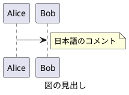
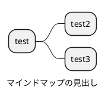
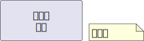
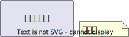

---
author:
    - Tetsuo Honda
subject: "subject"
description: "description"
date: "Thu, 28 Nov 2024 15:04:32 +0900"
abstract-title: "Abstract"
abstract: "概要"
---

<!--ja:-->
# pub-markdown を利用したドキュメント記載方法のプラクティス集
<!--:ja-->
<!--en:
# Practices for Writing Documentation with pub-markdown
:en-->

## 概要

本ドキュメントは、Markdown と Pandoc によるドキュメント発行のサンプル、運用方法およびノウハウをまとめたものです。

## 言語切替

日本語と英語を同一の Markdown に記載できます。

発行する際に、それぞれの言語別タグを切り替えて処理を行うため、成果物は単一言語向けにできます。

### 記載方法

#### ニュートラル言語

特殊タグで囲わない限り、 Markdown はニュートラル言語として扱われ、日英双方の成果物に含まれます。

#### 日本語・英語

以下のタグで囲うことにより、それぞれの言語別の成果物にのみ表示されます。

```markdown
<!--ja:
日本語 (編集プレビューで非表示状態)
:ja-->

<!--ja:-->
日本語 (編集プレビューで表示状態)
<!--:ja-->

<!--en:
English Hidden in Markdown
:en-->

<!--en:-->
English Visible in Markdown
<!--:en-->
```

#### 編集時の表示

編集時の表示・非表示は、発行後の表示状態に影響しません。

<!--ja:-->
### 記載例
<!--:ja-->
<!--en:
### Sample
:en-->

<!--ja:
日本語 (編集プレビューで非表示状態)
:ja-->

<!--ja:-->
日本語 (編集プレビューで表示状態)
<!--:ja-->

<!--en:
English Hidden in Markdown
:en-->

<!--en:-->
English Visible in Markdown
<!--:en-->

### Visual Studio Code 拡張機能

以下の Visual Studio Code 拡張機能により、編集時の言語切替作業の効率化が可能です。

- [vscode-multilang-md](https://marketplace.visualstudio.com/items?itemName=TetsuoHonda.vscode-multilang-md)

## 詳細情報

文章に詳細情報を記載する場合は以下のタグを利用します。

### 記載方法

```markdown
<!--details:
詳細 (編集プレビューで非表示状態)
:details-->

<!--details:-->
詳細 (編集プレビューで表示状態)
<!--:details-->
```

#### 編集時の表示

編集時の表示・非表示は、発行後の表示状態に影響しません。

### 記載例

<!--details:
詳細 (編集プレビューで非表示状態)
:details-->

<!--details:-->
詳細 (編集プレビューで表示状態)
<!--:details-->

### Visual Studio Code 拡張機能

以下の Visual Studio Code 拡張機能により、編集時の詳細切替作業の効率化が可能です。

- [vscode-multilang-md](https://marketplace.visualstudio.com/items?itemName=TetsuoHonda.vscode-multilang-md)

## インデックス (目次) の自動生成

`\toc` コマンドを使用して、指定された階層以下の Markdown ファイルから自動的にインデックス (目次) を生成できます。

### 基本的な使用方法

```markdown
\toc
```

現在のディレクトリにある Markdown ファイルのインデックスを生成します。

### パラメーター付きの使用方法

```markdown
\toc depth=1 exclude="temp.md" exclude="draft/*"
```

### パラメーター詳細

#### 階層数指定 (depth)

- `depth=0`: 現在のディレクトリのみ (デフォルト)
- `depth=1`: 現在のディレクトリ + 1 階層下まで
- `depth=2`: 現在のディレクトリ + 2 階層下まで
- `depth=-1`: 制限なし (全階層を掘り下げ)

#### 除外パターン (exclude)

```markdown
\toc exclude="temp.md"                    # 単一ファイル除外
\toc exclude="draft/*"                    # パターン除外
\toc exclude="temp.md" exclude="draft/*"  # 複数除外
```

- `"README.md"`: 特定ファイル
- `"draft/*"`: ディレクトリ配下全て
- `"*.tmp"`: 拡張子による除外

### 注意事項

- index.md または index.markdown が存在する場合、フォルダー名はそのファイルへのリンクになります
- index ファイル内の最初の `# タイトル` がフォルダーの表示名として使用されます

### 実際の例

`\toc depth=-1` による実際の出力例を以下に示します。

\toc depth=-1

## 画像の挿入

画像を図として挿入する場合、Pandoc にて、タイトルが定義されていない画像は図として扱われず、書式が設定されないため、`[` `]` による図のタイトルを Markdown に記載します。

## PlantUML

PlantUML は各プラグインとの親和性を考慮し、以下の通り Markdown に記載します。

### 言語名

plantuml とします。

> [!IMPORTANT]
> puml は使用しません。

### Plantuml タグ

`@startuml` `@enduml` は、PlantUML プラグインにてドキュメント内の PlantUML を出力する際の識別に使うため、必ず記載します。

### タイトル

`@startuml` に続いてファイル名を記載します。Visual Studio Code の PlantUML プラグインにて、エクスポートする際のファイル名に使われます。

また、上記とは別に `caption` キーワードでタイトルを記載します。`caption` は、PlantUML の図の見出しとして使われるとともに、Pandoc での発行時には図のキャプションになります。

背景色は、pandoc 側で skinparam backgroundColor transparent を自動付与して透明にしています。  
すでに skinparam backgroundColor が定義されている場合は、置換します。

### 記載例





### Chrome 拡張機能

以下の Chrome 拡張機能により、GitBucket での PlantUML 図形のレンダリングが可能です。

> [!WARNING]
> 企業内のイントラネット環境等で利用する場合、PlantUML サーバーの指定を必ず行うようにしてください。

- [Pegmatite-gitbucket](https://chromewebstore.google.com/detail/pegmatite-gitbucket/gkdjfofhecooaojkhbohidojebbpcene)

## Mermaid

Mermaid 記法について、以下の通り Markdown に記載します。  
Mermaid と PlantUML は実現できることが重複します。PlantUML を優先して採用してください。

### タイトル

コード ブロックのファイル名として記載します。

### 記載例

```{.mermaid caption="Mermaid のキャプション"}
sequenceDiagram
    Alice->>John: Hello John, how are you?
    John-->>Alice: いいね!
```

## draw.io

draw.io は各プラグインとの親和性を考慮し、以下の通り Markdown に記載します。

### 形式

Markdown から引用して用いるため、drawio.svg とします。

Markdown から引用して表示した場合には代表シートのみ表示されるため、1 つの drawio.svg ファイルには複数シートを定義しません。

### Markdown への引用

原則として、drawio.svg ファイルは Markdown から参照します。

単一ファイルとしての drawio.svg ファイルは、docx フォーマットや html-self-contained フォーマットの出力結果には含まれません。

### 記載例



### ノウハウ

#### draw.io でテキストを含む図形が正しく変換できない場合の対処

docx 変換後に `Text is not SVG - cannot display` と表示されるケースがあります。これは draw.io が .svg の高度な機能 (foreignObject) を利用しているためです。

[Why text in exported SVG images may not display correctly](https://www.drawio.com/doc/faq/svg-export-text-problems)

この問題を回避するため、テキスト記入時は以下のようにします。

- 「テキスト」の 「ワード ラップ」 のチェックを外す。
- 「テキスト」の 「フォーマットされたテキスト」 のチェックを外す。

本フレームワークでは、.drawio.svg ファイルに foreignObject が含まれる場合、それを可能な限り取り除くことで不具合の発生を低減します。  
svg に外部から編集を加えるため、意図せぬ結果になっていないか最終出力を確認してください。



#### ダーク テーマの Visual Studio Code で画面が見づらい場合

Draw.io Integration のテーマを loght テーマ (例: kennedy - light) に変更します。

- [VSCode で Draw.io を編集できるようにするまで](https://zenn.dev/satonopan/articles/4177ed8b88e067)
- [VScode の拡張機能「Draw.io Integration」で背景色を白色に変更する方法](https://penpen-dev.com/blog/vscode-drawio/)

Visual Studio Code ステータス エリア (右下) の `Theme:` 部分をクリックすることで、拡張機能の設定を経由せずにテーマを変更できます。

## OpenAPI

OpenAPI ファイルは、widdershins により Markdown に変換した後で Pandoc に渡されます。

### 記載例

[OpenAPI ファイルへ](books-swagger.yaml)

## AsyncAPI

現段階では、AsyncAPI の発行は未サポートです。

AsyncAPI 1.0 形式については、widdershins により変換できる可能性がありますが、未検証です。

## リンク

Markdown 内のリンクは、.html や .docx への変換時も維持されます。

[サブフォルダーの index へ](subfolder/index.md)

## コード スニペット

### Bash

```bash
echo "Hello"
```

### CSharp

```csharp
Debug.WriteLine("Test");
Debug.WriteLine("日本");
```

## 表

[列幅の指定方法](https://github.com/jgm/pandoc/issues/2486) により、ページ幅に収まらなかった場合の列幅を指定できます。

表に続いて、`Table:` または `:` を記載して表のキャプションを指定します。

|No.|内容     |
|--:|---------|
|  1|てすと   |
|  2|テスト   |
|  3|Test     |

Table: 表のキャプション (`Table: 表のキャプション`)

|No.|内容     |
|--:|---------|
|  1|てすと   |
|  2|テスト   |
|  3|Test     |

: 表のキャプション (`: 表のキャプション`)

セル内に改行を挿入する場合は、`<br />` を使用します。

|No.|ヘッダー 1 行目<br />ヘッダー 2 行目|
|--:|---------|
|  1|内容 1<br />内容 2|
|  2|テスト   |
|  3|Test     |

Table: セル内での改行を含む表

以下の形式 (Markdown pipe tables) も Pandoc ではサポートされます。  
ただし、[Markdown Preview Enhanced](https://marketplace.visualstudio.com/items?itemName=shd101wyy.markdown-preview-enhanced) プラグインでのプレビューは現時点で非サポートのため、編集時の使い勝手を判断して使用してください。  
[Table: support grid tables](https://github.com/shd101wyy/vscode-markdown-preview-enhanced/issues/1571)

+------------------+-------------+
| Distance         | Time        |
| (km)             | (s)         |
+==================+=============+
| 12               | 34          |
+------------------+-------------+
| 56               | 78          |
+------------------+-------------+

Table: Markdown pipe tables による表 1

+-----+-----------+
|     | L2 and L3 |
| L1  +-----+-----+
|     | L2  | L3  |
+=====+=====+=====+
|     | BBB | CCC |
| AAA +-----+-----+
|     |   DDDDD   |
+-----+-----+-----+
|           | FFF |
|   EEEEE   +-----+
|           | GGG |
+-----------+-----+

Table: Markdown pipe tables による表 2

## メタデータ

Markdown の先頭に以下のように記載します。

```text
---
author:
    - author               <- 「作成者」プロパティ
    - author2              <- 複数人定義可能
subject: "subject"         <- 「件名」プロパティ
description: "description" <- 「コメント」プロパティ
abstract-title: "Abstract" <- 「概要タイトル」プロパティ
abstract: "概要"           <- 「概要」プロパティ
---
```

YAML front matter に `pub_markdown.skip: true` を定義した Markdown は通常の HTML/docx 発行対象および `\toc` の目次生成対象から除外されます。

## 改ページ

docx 変換時に改ページを挿入したい場合は、`\newpage` を挿入します。

これは 1 つ目のパラグラフです。

\newpage

これは 2 つ目のパラグラフです。

### メタデータの扱い

- 第 1 レベルのタイトルが、文書のタイトルになります (title の指定は無視されます)。
- 以下のルールで著者が設定されます。
    1. メタデータの author が指定されている  
       → メタデータの author
    2. pub_markdown.config に autoSetAuthor: true が指定されている場合
        1. git コマンドが使えない  
           → 空文字
        2. Git 管理下にない  
           → 空文字
        3. Git 管理下にあり、コミット履歴あり  
           → コミッターリスト (新しい順、重複排除)
- 以下のルールで日付が設定されます。
    1. メタデータの date が指定されている  
       → メタデータの date
    2. pub_markdown.config に autoSetDate: true が指定されている場合
        1. git コマンドが使えない  
           → ファイルの最終更新時刻 (RFC2822)
        2. Git 管理下にない  
           → ファイルの最終更新時刻 (RFC2822)
        3. Git 管理下にあり、変更あり  
           → ファイルの最終更新時刻 (RFC2822) + 最終コミット ID + "+"
        4. Git 管理下にあり、変更なし  
           → 最終コミット時刻 (RFC2822) + 最終コミット ID

## Pandoc テンプレート

bin/styles 以下にカスタマイズされた Pandoc テンプレートがあります。

### html

`pandoc -D 'html'` コマンドで出力されたデフォルト テンプレートに置き換えることで、デフォルトの出力に変更できます。

### docx

`pandoc -o custom-reference.docx --print-default-data-file reference.docx` コマンドで出力したサンプルを Word テンプレート形式 (.dotx) で出力したものに置き換えることで、デフォルトの出力に変更できます。

図の幅はページ サイズおよび余白に基づいて Pandoc で調整されます。~~とじしろ (w:gutter) は考慮されないため、とじしろを定義した場合は図の横幅が期待通りとなりません。テンプレート作成時は留意してください。~~  
→ Pandoc 3.1.6 より、ページ設定の余白のとじしろが反映されていないバグが修正されました。[Gutters on margin specs not picked up from custom-reference.docx (HTML to .docx) #8946](https://github.com/jgm/pandoc/issues/8946)

## 発行方法

- Visual Studio Code で、タスク "exec pandoc" (Ctrl + Shift + B) を実行します。
- 現在開いている Markdown のみを対象に発行を行う場合は、タスク "exec pandoc (current file)" を実行します。

成果物は、言語別、フォーマット別に生成されます。

## 参考にしたサイト

- [Markdown を pandoc で HTML 化するときのノウハウ](https://kiririmode.hatenablog.jp/entry/20220227/1645935125)
- [44 種類のフォーマットに対応した Pandoc で Markdown を HTML 形式に変換する](https://dev.classmethod.jp/articles/pandoc-markdown2html/)
