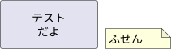
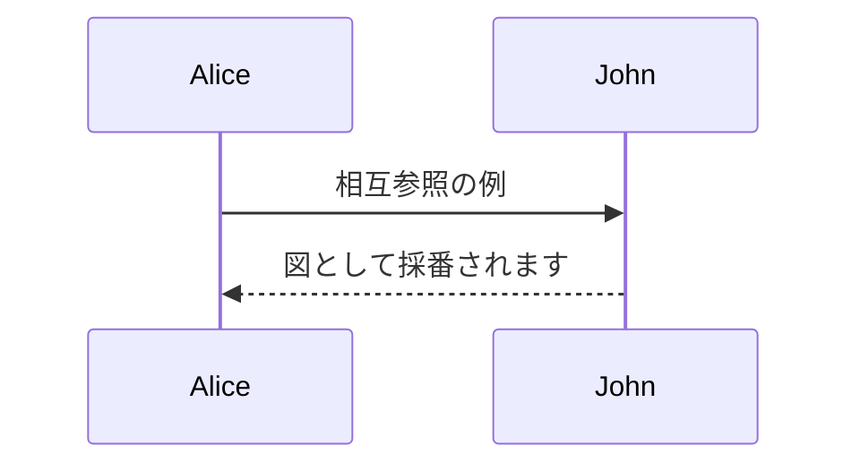

# 相互参照サンプル

pandoc-crossref により、ラベルを付けた図、リスト、表を採番して本文から参照できます。
ラベルのない図やリストは採番されません。

## 画像

[@fig:a_image] に例を示す。

{#fig:a_image}

## Mermaid

[@fig:crossref_mermaid] に例を示す。



CodeBlock: Mermaid の図 {#fig:crossref_mermaid}

## コード ブロック

[@lst:crossref_listing] に例を示す。

```c
int main(void)
{
    return 0;
}
```

CodeBlock: リストとして採番されるコード {#lst:crossref_listing}

## 表

[@tbl:crossref_table] に例を示す。

|No.|内容     |
|--:|---------|
|  1|てすと   |
|  2|テスト   |

Table: 表のキャプション {#tbl:crossref_table}
