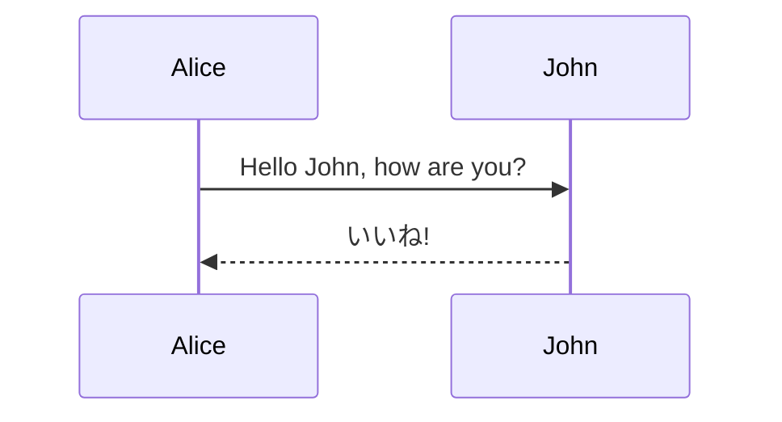
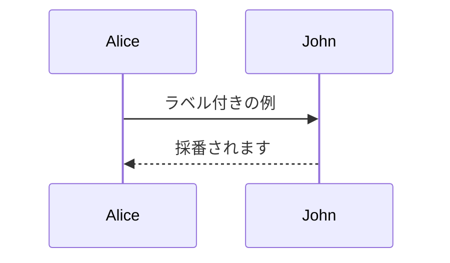
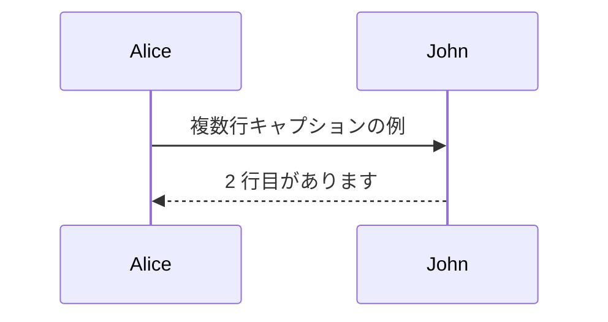

# Mermaid キャプションのサンプル

Mermaid のキャプションは、コード ブロックの直後に `CodeBlock:` 行を置いて指定します。  
フェンスには言語名だけを記載するため、GitHub などの Web 表示でも図がそのまま描画されます。

## キャプションあり

CodeBlock: Mermaid のキャプション

## ラベル付き (相互参照)

`{#fig:xxx}` を付けると pandoc-crossref が採番し、[@fig:mermaid-caption-label] のように本文から参照できます。

CodeBlock: ラベル付きの Mermaid {#fig:mermaid-caption-label}

## 複数行のキャプション

キャプションを段落内で改行すると、キャプションも複数行で出力されます。

> [!NOTE]
> 複数行のキャプションは DOCX 出力で結果が崩れるため、非推奨です。

CodeBlock: 1 行目のキャプション  
2 行目のキャプション

## キャプションなし

