# Mermaid ショーケース

Mermaid の各図種のサンプルを示します。

## Flowchart

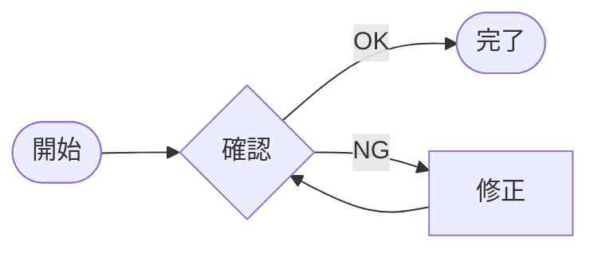

CodeBlock: Flowchart のサンプル

## Sequence

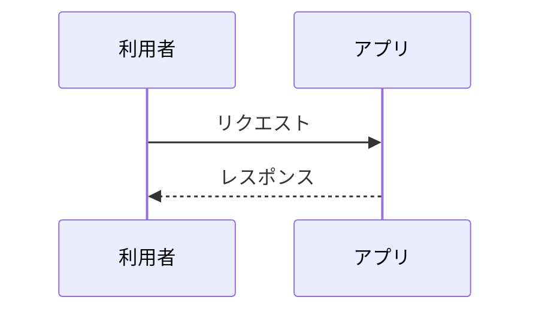

CodeBlock: Sequence のサンプル

## Class

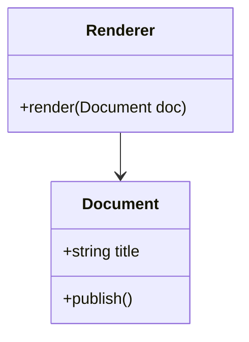

CodeBlock: Class のサンプル

## State

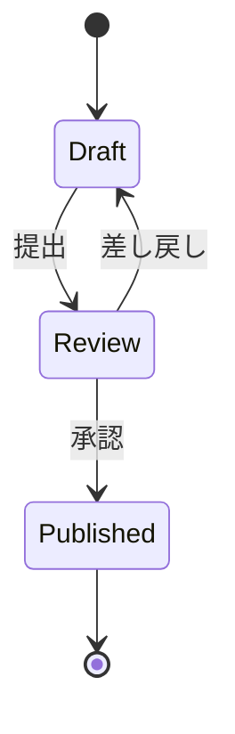

CodeBlock: State のサンプル

## ER

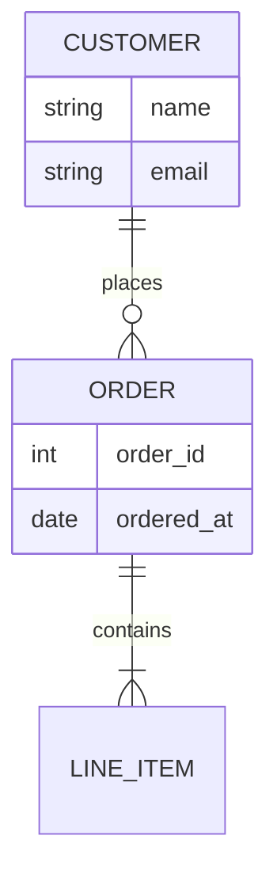

CodeBlock: ER のサンプル

## User Journey

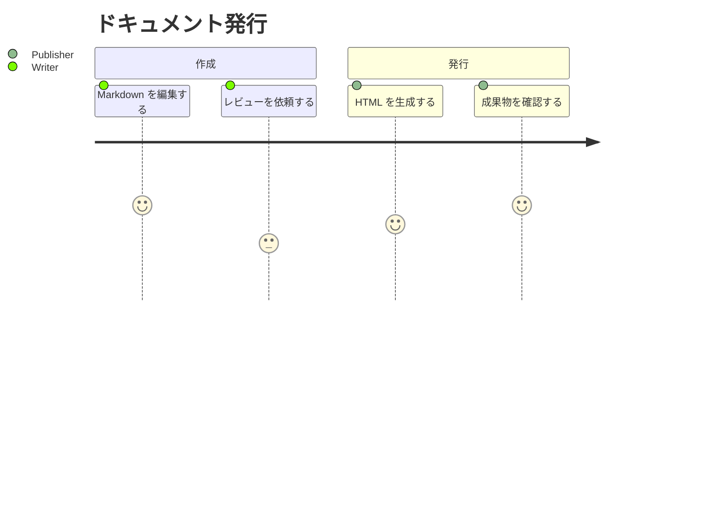

CodeBlock: User Journey のサンプル

## Gantt

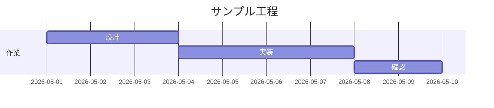

CodeBlock: Gantt のサンプル

## Pie

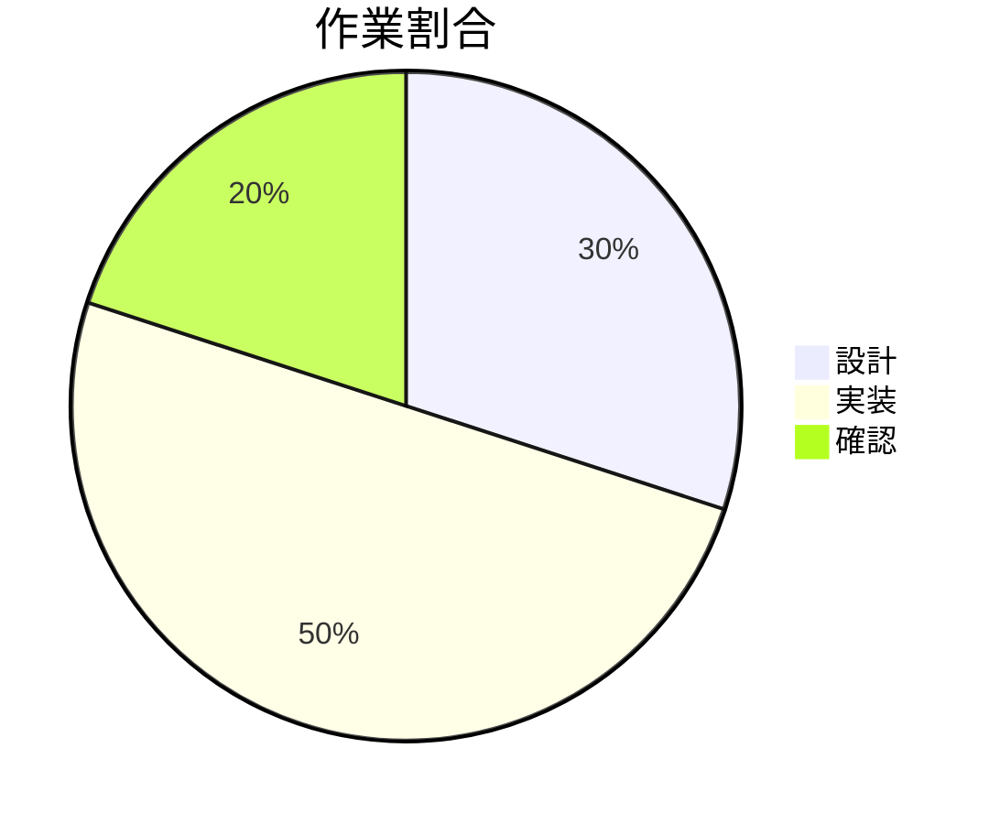

CodeBlock: Pie のサンプル

## Quadrant

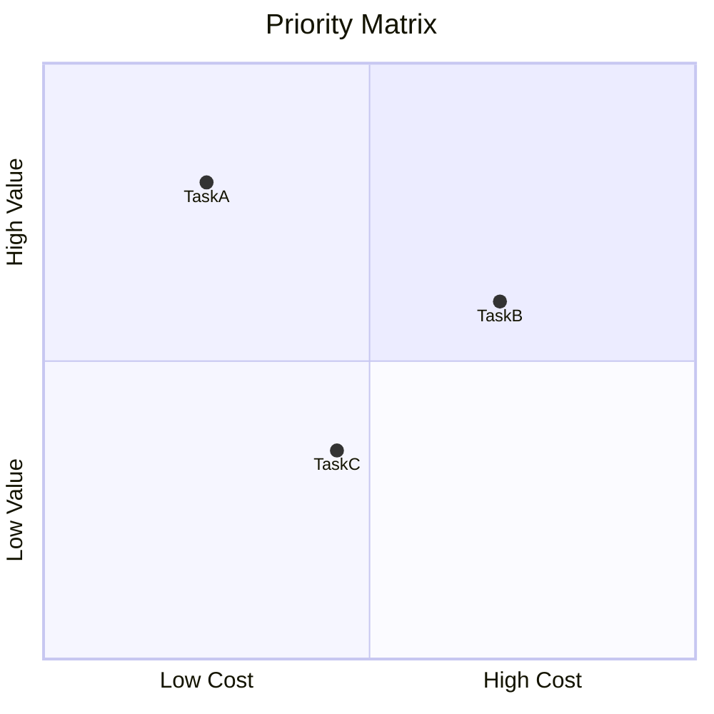

CodeBlock: Quadrant のサンプル

## Requirement

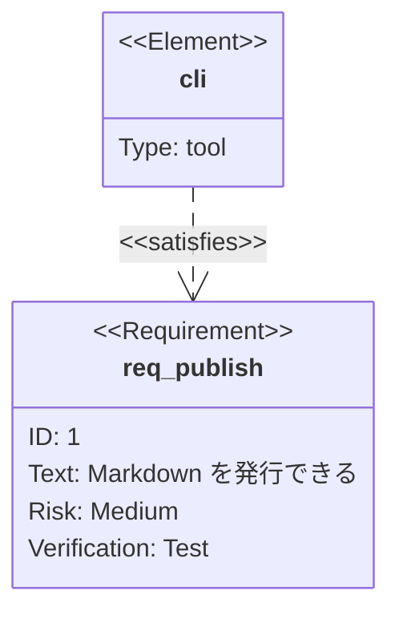

CodeBlock: Requirement のサンプル

## GitGraph

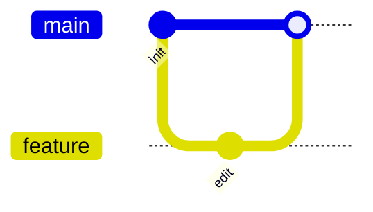

CodeBlock: GitGraph のサンプル

<!--
## C4

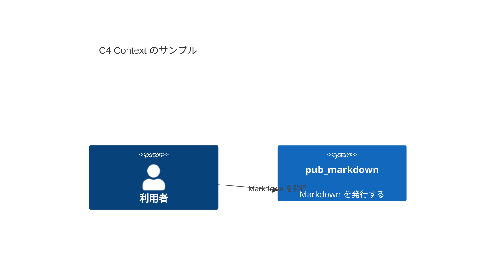

CodeBlock: C4 のサンプル
-->

## Mindmap

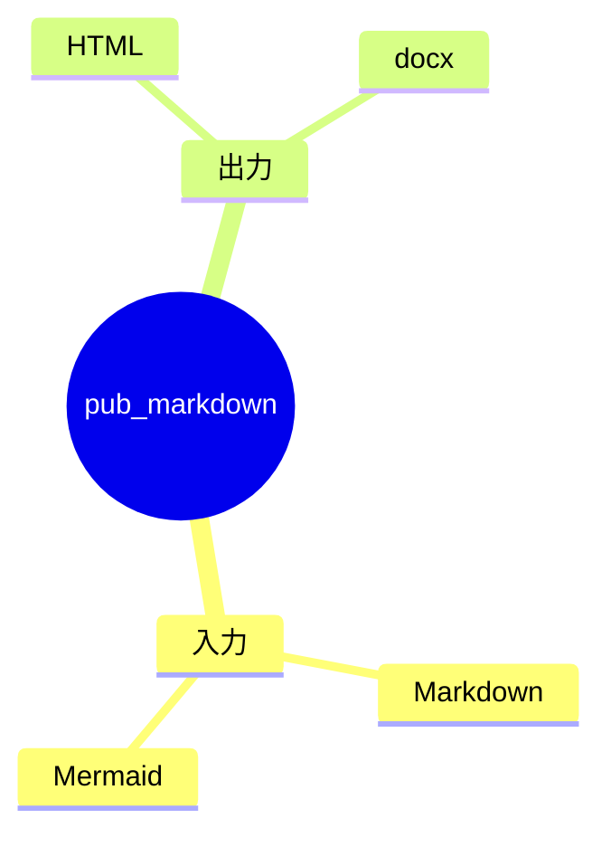

CodeBlock: Mindmap のサンプル

## Timeline

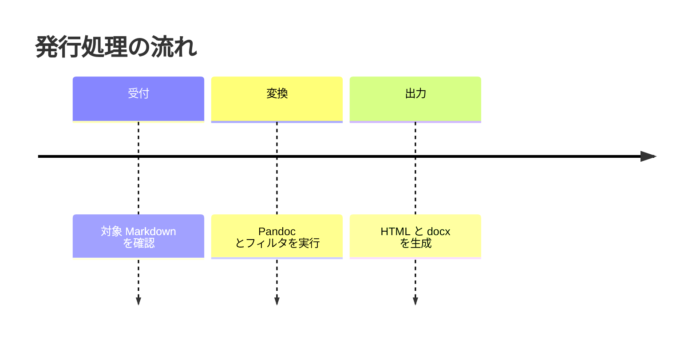

CodeBlock: Timeline のサンプル

<!--
## ZenUML

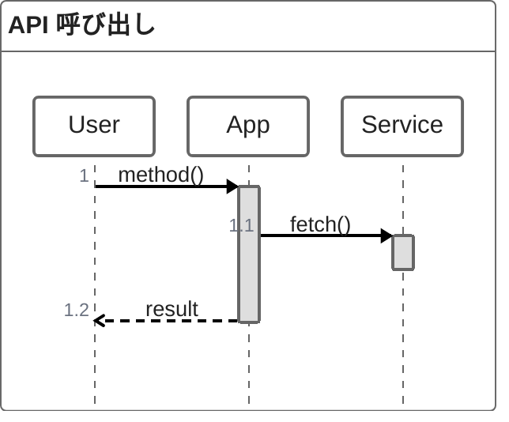

CodeBlock: ZenUML のサンプル
-->

## Sankey

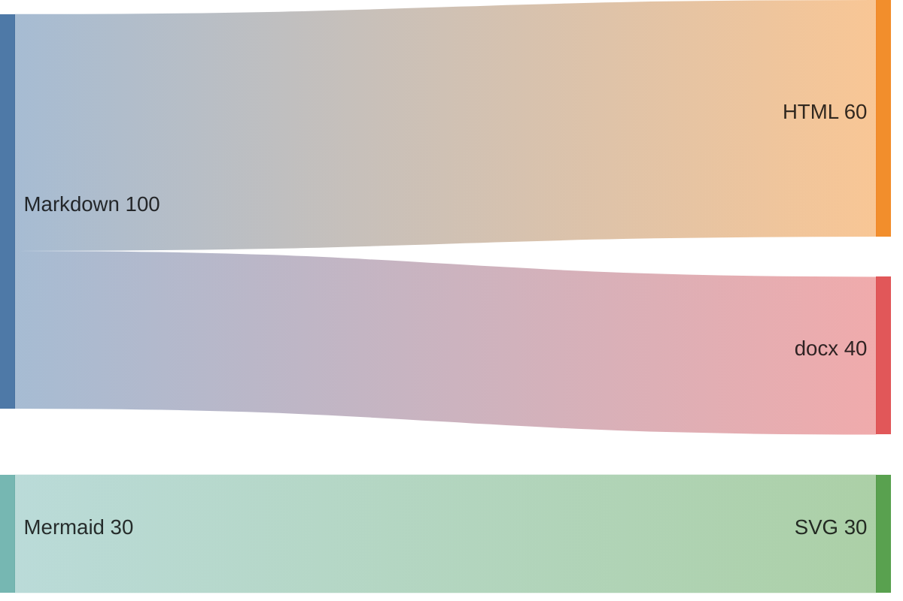

CodeBlock: Sankey のサンプル

## XY Chart

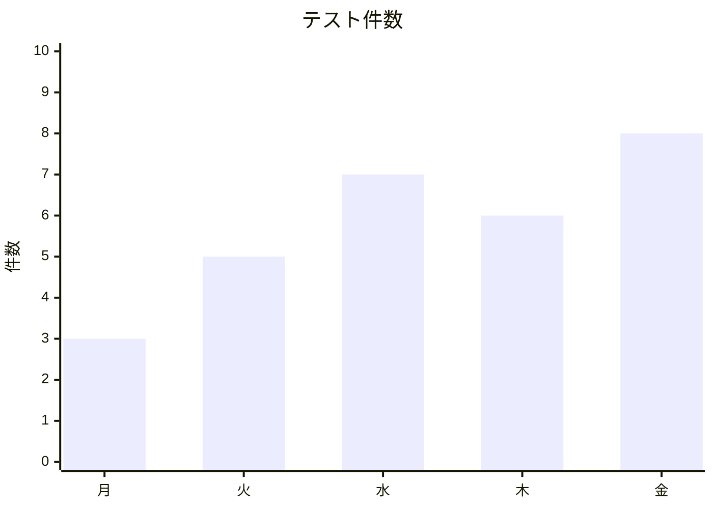

CodeBlock: XY Chart のサンプル

## Block

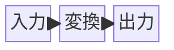

CodeBlock: Block のサンプル

## Packet

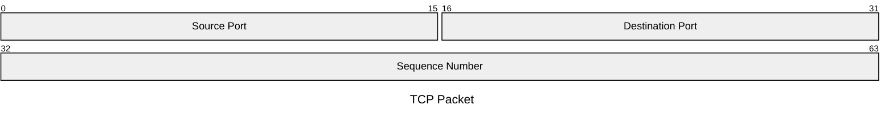

CodeBlock: Packet のサンプル

## Kanban

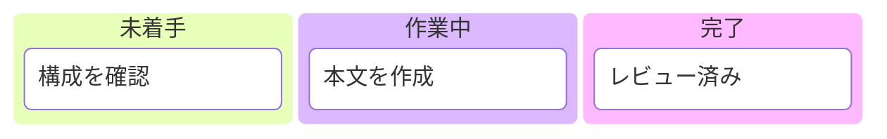

CodeBlock: Kanban のサンプル

## Architecture

```mermaid
architecture-beta
    group app(cloud)[Application]
    service user(internet)[User]
    service docs(server)[Docs] in app
    service store(database)[Storage] in app
    user:R --> L:docs
    docs:R --> L:store
```

CodeBlock: Architecture のサンプル

## Radar

```mermaid
radar-beta
    axis d["Design"], i["Implement"], t["Test"], doc["Docs"]
    curve current["Current"]{4,3,5,4}
    curve target["Target"]{5,5,5,5}
    max 5
    min 0
```

CodeBlock: Radar のサンプル

## Treemap

```mermaid
treemap
    title 成果物の内訳
    "HTML": 60
    "docx": 30
    "SVG": 10
```

CodeBlock: Treemap のサンプル

## Venn

```mermaid
venn-beta
    title Scope
    set HTML: 50
    set docx: 40
    set Markdown: 30
    union HTML,Markdown: 20
    union docx,Markdown: 15
```

CodeBlock: Venn のサンプル

## Ishikawa

```mermaid
ishikawa
    title 品質課題
    "表示崩れ"
        "入力"
            "Markdown"
            "図"
        "変換"
            "Pandoc"
            "フィルタ"
        "出力"
            "HTML"
            "docx"
```

CodeBlock: Ishikawa のサンプル

## Wardley

```mermaid
wardley-beta
    title Publish Flow
    anchor User [0.95, 0.75]
    component Markdown [0.70, 0.55]
    component Pandoc [0.45, 0.35]
    component Output [0.25, 0.20]
    User -> Markdown
    Markdown -> Pandoc
    Pandoc -> Output
```

CodeBlock: Wardley のサンプル

## TreeView

```mermaid
treeView-beta
    "docs"
      "sample"
        "mermaid.md"
        "plantuml.md"
      "README.md"
```

CodeBlock: TreeView のサンプル
