# PlantUML ショーケース

PlantUML の各図種のサンプルを示します。

## Sequence

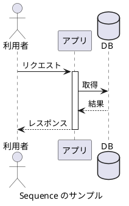

## Use Case

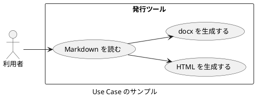

## Class

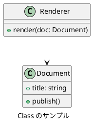

## Object

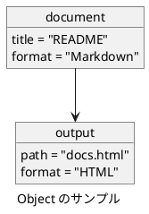

## Activity

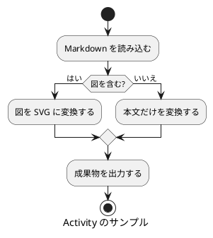

## Component

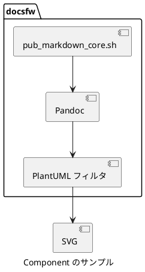

## Deployment

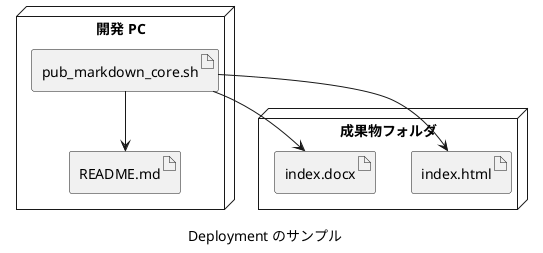

## State

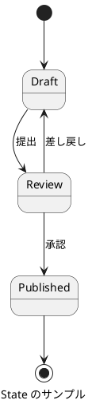

## Timing

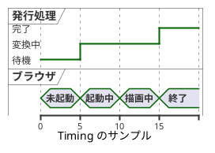

## Network

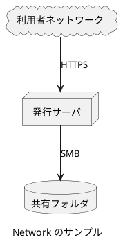

## Mindmap

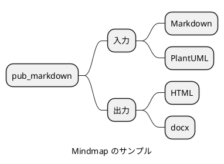

## WBS

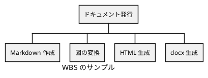

## Gantt

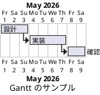

## Work Breakdown

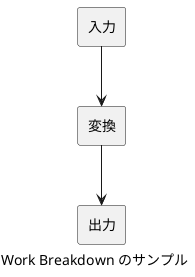

## Salt

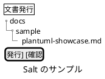

## JSON

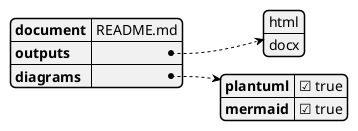

## YAML

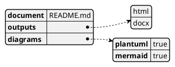

## EBNF

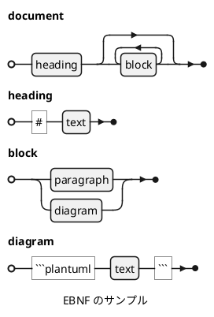

## Regex

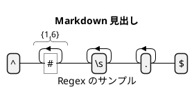
