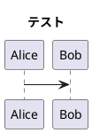

# README

これはトップレベルの README です。

## C# テスト

```csharp
Debug.WriteLIne("Test");
```

## 言語切替テスト

<!--ja:
    日本語(ニュートラル md で非表示状態)
:ja-->
<!--ja:-->
    日本語(ニュートラル md で表示状態)
<!--:ja-->
<!--en:
    English Hidden in markdown
:en-->
<!--en:-->
    English Visible in markdown
<!--:en-->

## Plantuml テスト



## draw.io テスト


### draw.io でテキストを入れると上手く変換できない

文字を入れると Not supporrted by viewer や改行等の文字コードが入ってしまう。
draw.io のヘルプに解決策が載っている。

- プロパティの text の Formatted Text option のチェックを外す
- プロパティの text の Word Wrap option のチェックを外す

## リンクテスト

[サブフォルダ](subfolder/index.md)

## 参考

https://kiririmode.hatenablog.jp/entry/20220227/1645935125
https://dev.classmethod.jp/articles/pandoc-markdown2html/

