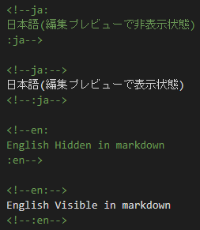
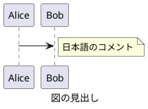

---
author:
 - Tetsuo Honda
subject: "subject"
description: "description"
---

<!--ja:-->
# トップレベルの index
<!--:ja-->
<!--en:
# index of top level
:en-->

## 概要

本ドキュメントは、Markdown と Pandoc によるドキュメント発行のサンプル、運用方法およびノウハウをまとめたものである。

## 言語切替

日本語と英語を同一の Markdown に記載できる。
ビルドする際に、それぞれの言語別タグを切り替えて処理を行うことから、成果物は単一言語向けとすることができる。

### 記載方法

#### ニュートラル言語

特殊タグで囲わない限り、 Markdown はニュートラル言語として扱われ、日英双方の成果物に含まれる。

#### 日本語・英語

以下のタグで囲うことにより、それぞれの言語別の成果物にのみ表示される。



#### 編集時の表示

編集時の表示・非表示は、ビルド後の表示状態に影響しない。

<!--ja:-->
### 記載例
<!--:ja-->
<!--en:
### Sample
:en-->

<!--ja:
日本語(編集プレビューで非表示状態)
:ja-->

<!--ja:-->
日本語(編集プレビューで表示状態)
<!--:ja-->

<!--en:
English Hidden in Markdown
:en-->

<!--en:-->
English Visible in Markdown
<!--:en-->

## 画像の挿入

画像を図として挿入する場合、`[` `]` による図のタイトルを Markdown に記載する。

> Pandoc にて、タイトルが定義されていない画像は図として扱われず、書式が設定されないため。

## PlantUML

PlantUML は各プラグインとの親和性を考慮し、以下の通り Markdown に記載する。

### 言語名

plantuml とする。

> puml は使用しない。

### Plantuml タグ

`@startuml` `@enduml` は必ず記載する。

> PlantUML プラグインにて、ドキュメント内の PlantUML を出力する際の識別に使いるため。

### タイトル

`@startuml` に続いてファイル名を記載する。

> Visual Studio Code の PlantUML プラグインにて、エクスポートする際のファイル名に使いられる。

また、上記とは別に `caption` キーワードにてタイトルを記載する。

> PlantUML の図の見出しとして使いられる。
> Pandoc での発行時には図のキャプションとなる。

### 記載例



## draw.io

draw.io は各プラグインとの親和性を考慮し、以下の通り Markdown に記載する。

### 形式

Markdown から引用して用いるため、drawio.svg とする。

Markdown から引用して表示した場合には代表シートのみ表示されるため、1 つの drawio.svg ファイルには複数シートを定義しない。

Visual Studio Code による編集時は、ライトテーマに設定してから行う。
Visual Studio Code ステータスエリア (右下) の `Theme:` 部分をクリックすることでテーマの変更ができる。

### Markdown への引用

原則、drawio.svg ファイルは、Markdown から参照する。
単一ファイルとしての drawio.svg ファイルは、docx フォーマットや html-self-contained な出力結果には含まれない。

### 記載例


### ノウハウ

#### draw.io でテキストを含む図形が正しく変換できない場合

日本語テキストを含む図形にて docx 変換後に Not supporrted by viewer と表示されるケースがある。
この問題を回避するため、テキスト記入時は以下とする。

- 「テキスト」の 「ワードラップ」 のチェックを外す。
- 「テキスト」の 「フォーマットされたテキスト」 のチェックを外す。

## リンク

Markdown 内のリンクは、.html や .docx への変換時も維持される。

[サブフォルダの index へ](subfolder/index.md)

## コードスニペット

### Bash

```bash
echo "Hello"
```

### CSharp

```csharp
Debug.WriteLIne("Test");
Debug.WriteLIne("日本");
```

## 表

|No.|内容     |
|--:|---------|
|  1|てすと   |
|  2|テスト   |
|  3|Test     |

## メタデータ

Markdown の先頭に以下のように記載する。

```text
---
author:
 - author <- 「作成者」プロパティ
 - author2 <- 複数人定義可能
subject: "subject" <- 「件名」プロパティ
description: "description" <- 「コメント」プロパティ
---
```

## 改ページ

docx 変換時に改ページを挿入したい場合は、`\newpage` を挿入しておく。

これは 1 つ目のパラグラフです。

\newpage

これは 2 つ目のパラグラフです。

### exec-pandoc.sh 固有のメタデータの扱い

利便性向上のため exec-pandoc.sh にて以下の処理を行っているため、標準の Pandoc と挙動が異なる。

- 第 1 レベルのタイトルが、文書のタイトルになる。
  (title の指定は無視される)
- 発行時の日時が、文章の日時になる。
  (date の指定は無視される)

## Pandoc テンプレート

bin/styles 以下にカスタマイズされた Pandoc テンプレートがある。

### html

`pandoc -D 'html'` コマンドで出力されたデフォルトテンプレートに置き換えることで、デフォルトの出力に変更できる。

### docx

`pandoc -o custom-reference.docx --print-default-data-file reference.docx` コマンドで出力したサンプルを Word テンプレート形式 (.dotx) で出力したものに置き換えることで、デフォルトの出力に変更できる。

## 発行方法

- Visual Studio Code で、タスク "exec pandoc" を実行する。
  (Ctrl + Shift + B)

あるいは

- Git Bash で、exec-pandoc.sh を実行する。

成果物は、/target 配下に、言語別、フォーマット別に生成される。

## 参考にしたサイト

- [MarkdownをpandocでHTML化するときのノウハウ](https://kiririmode.hatenablog.jp/entry/20220227/1645935125)
- [44種類のフォーマットに対応したPandocでMarkdownをHTML形式に変換する](https://dev.classmethod.jp/articles/pandoc-markdown2html/)
- [VScodeの拡張機能「Draw.io Integration」で背景色を白色に変更する方法](https://penpen-dev.com/blog/vscode-drawio/)
